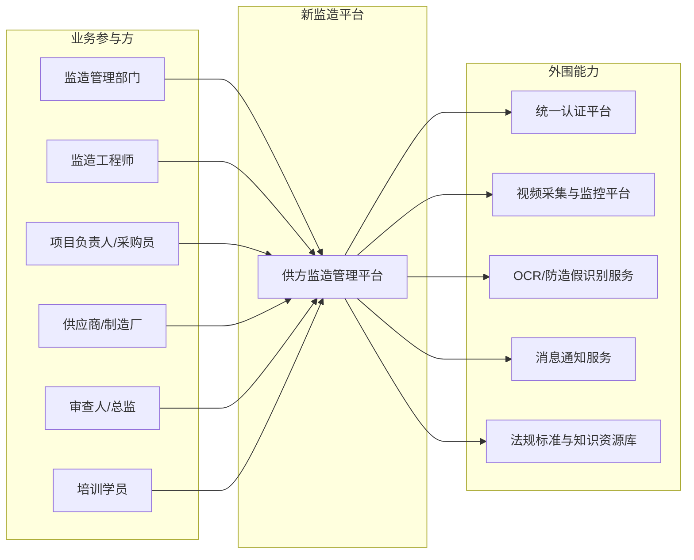
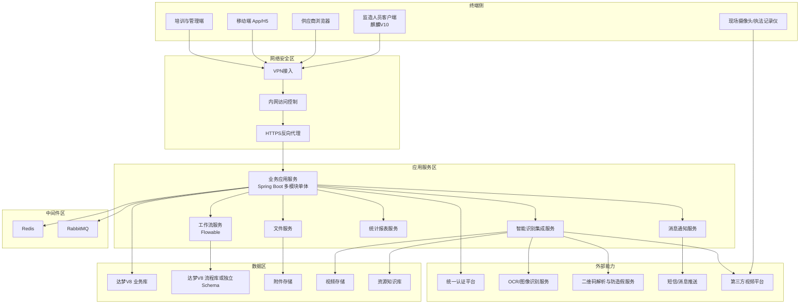
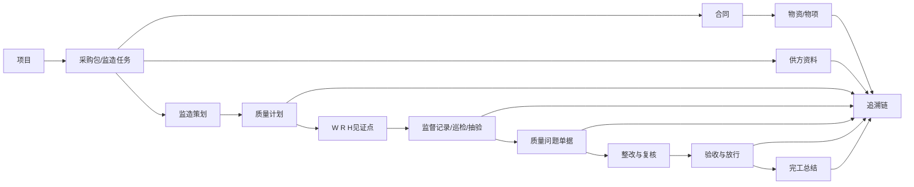

# 新需求架构图文档

## 1. 系统上下文图

## 2. 逻辑架构图

下图改为静态 SVG 分层图，保留原有全部节点，避免 Mermaid 自动布局导致文字过小、连线拥挤。

## 3. 部署架构图

## 4. 核心数据关系图

## 5. 架构落地结论

- 参考项目可直接复用的架构思想：
  - 单体多模块后端组织方式。
  - 流程审批由`Flowable`承载。
  - 权限与数据权限由`Shiro`承载。
  - 附件上传、下载、预览已经有统一文件服务。
  - 缓存/待办/消息联动可沿用`Redis + RabbitMQ`模式。
- 新系统与参考项目的主要差异：
  - 数据库需从参考项目当前的`MySQL`落到新需求指定的`达梦V8`。
  - 功能域从现有“项目派工、交底、日志、周报、问题、交接”扩展到“供方文件审核、质量计划、验收放行、OCR防造假、培训考试、付款台账”等全链条。
  - 现场视频、OCR、防造假、二维码、知识资源库均属于新增集成能力。
- 建议的技术边界：
  - 主业务库与流程库分开，至少分`Schema`，便于迁移、归档和性能治理。
  - 供应商协同、审批流、问题闭环、文件归档必须共享统一编码体系，保证追溯链可闭环。
  - 智能识别能力应通过集成服务接入，不要直接耦合到核心业务模块。
