# 新需求核心业务流程图

## 1. 说明

- 本文覆盖新需求文档中`3-17`号核心业务功能。
- `1 资质`与`2 应用案例`属于背景信息，不单独绘制流程图。
- 流程设计结合了参考项目中已存在的近似能力：任务派工、交接、日志、周报、问题、文件、审批流、供应商端接口。

## 2. 体系文件管理

覆盖需求：`3 体系文件管理`

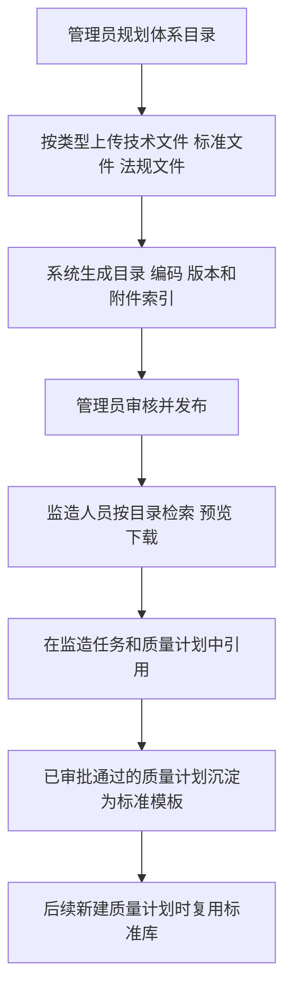

## 3. 任务分配管理

覆盖需求：`4 任务分配管理`

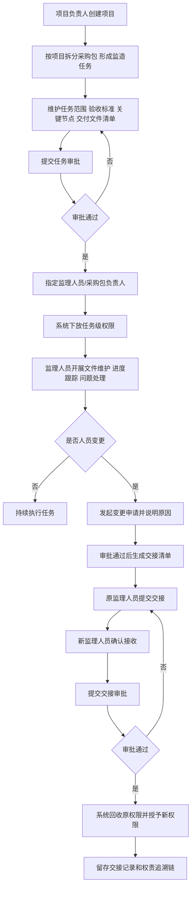

## 4. 策划管理

覆盖需求：`5 策划管理`

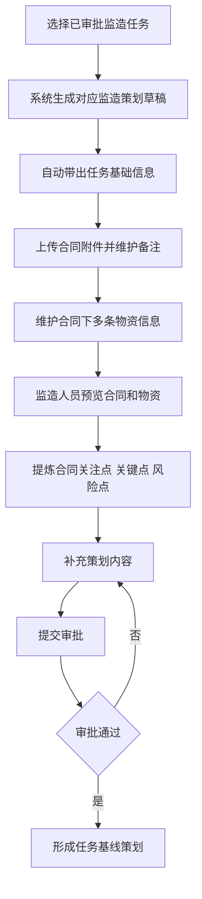

## 5. 供方文件审核

覆盖需求：`7 供方文件审核`

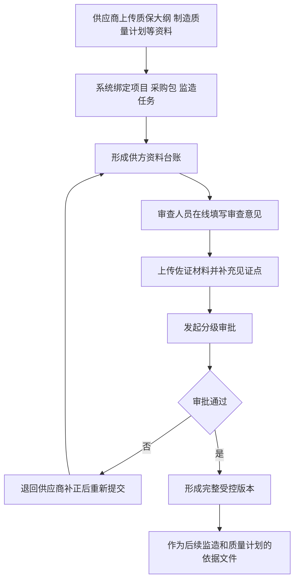

## 6. 质量计划标准建立

覆盖需求：`8 质量计划标准建立`

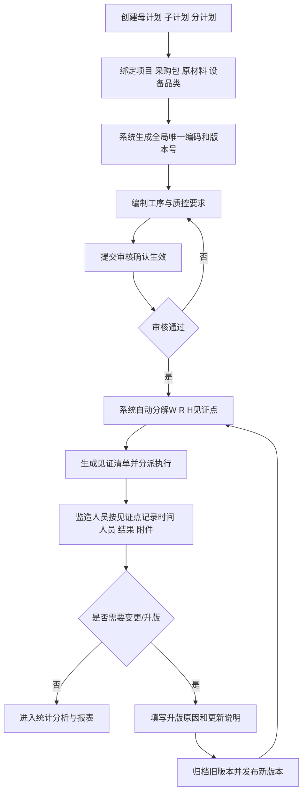

## 7. 监造过程监督和执行

覆盖需求：`9 监造过程监督和执行`

```mermaid
flowchart TD
    A[监造人员选择监造任务] --> B{选择监督场景}
    B -- 日常监督 --> C1[记录生产工艺 设备状态 人员规范]
    B -- 质量计划执行 --> C2[按W R H见证点逐项执行]
    B -- 专项监督 --> C3[按专项主题 检查项 判定标准执行]
    B -- 巡检 --> C4[创建周度/月度巡检任务并执行]
    C1 --> D[上传现场照片 记录和附件]
    C2 --> D
    C3 --> D
    C4 --> D
    D --> E{是否发现问题}
    E -- 否 --> F[更新任务进度与统计数据]
    E -- 是 --> G[从业务记录直接发起问题单据]
    G --> H[进入问题闭环流程]
```

## 8. 监造质量问题处理

覆盖需求：`10 监造质量问题处理`

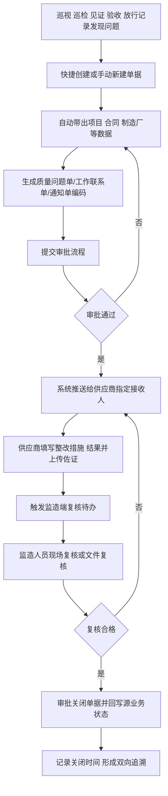

## 9. 监造巡查管理

覆盖需求：`11 监造巡查管理`

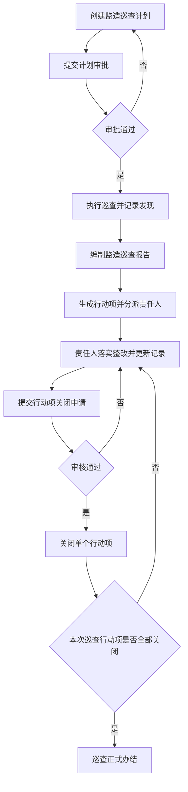

## 10. 抽查复验管理

覆盖需求：`12 抽查复验管理`

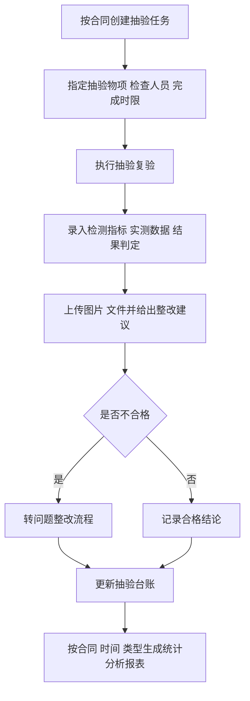

## 11. 监造记录

覆盖需求：`13 监造记录`

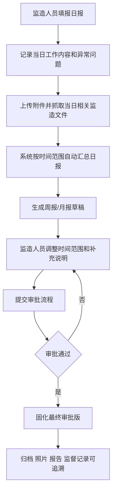

## 12. 监造完工管理

覆盖需求：`14 监造完工管理`

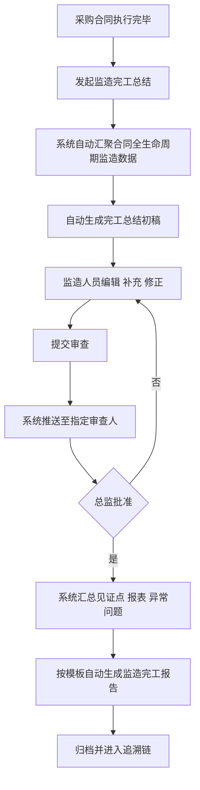

## 13. 监造验收

覆盖需求：`15 监造验收`

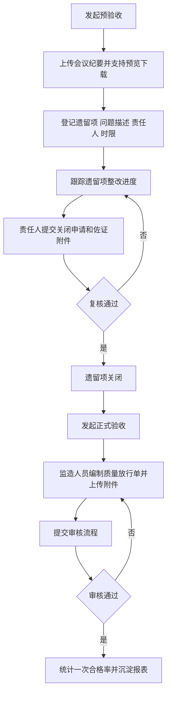

## 14. 监造放行

覆盖需求：`16 监造放行`

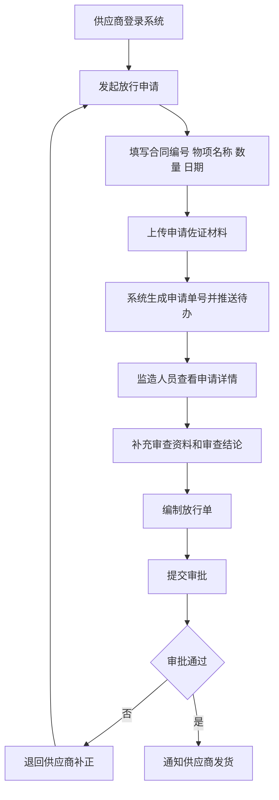

## 15. 质量追溯

覆盖需求：`17 质量追溯`

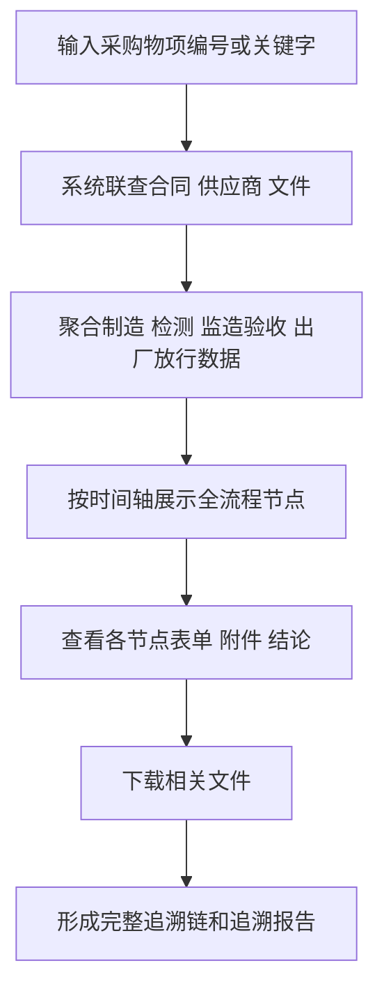
