# 新需求扩展业务流程图

## 1. 说明

- 本文覆盖新需求文档中`18-29`号扩展与支撑功能。
- 这些功能大多建立在核心业务链已经打通的前提下，通过统计、预警、识别、协同和经营辅助形成闭环。

## 2. 数据统计及质量趋势分析

覆盖需求：`18 数据统计及质量趋势分析`

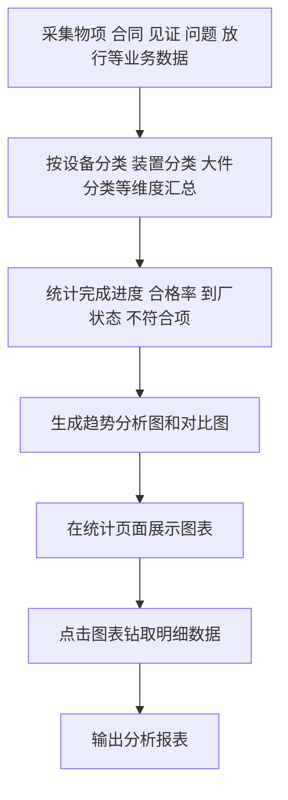

## 3. 产品进度跟踪及风险预警

覆盖需求：`19 产品进度跟踪及风险预警`

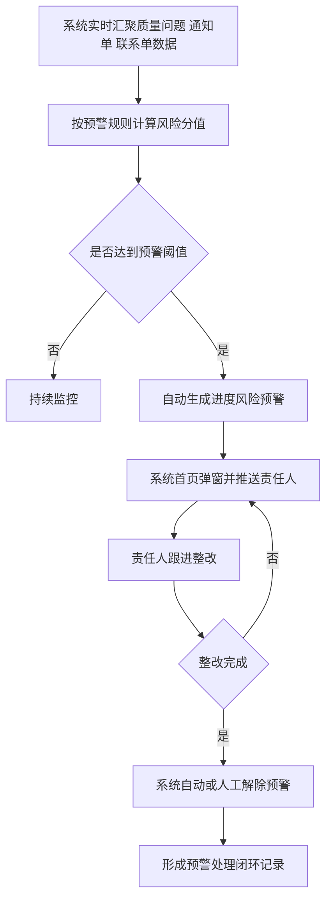

## 4. 防造假管理

覆盖需求：`20 防造假管理`

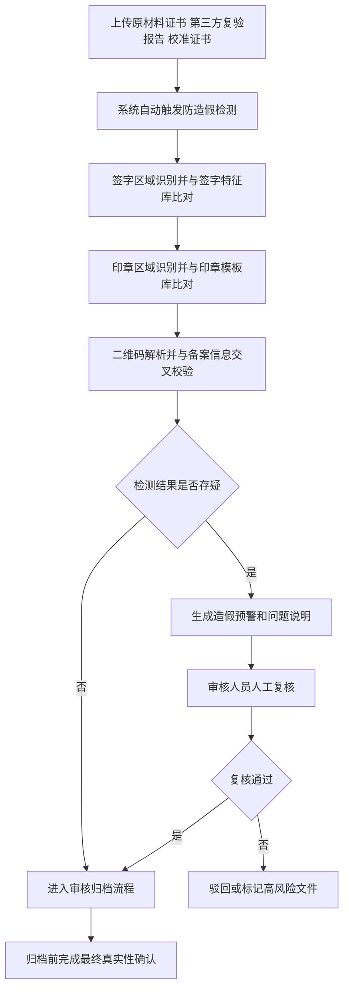

## 5. 可视化管理

覆盖需求：`21 可视化管理`

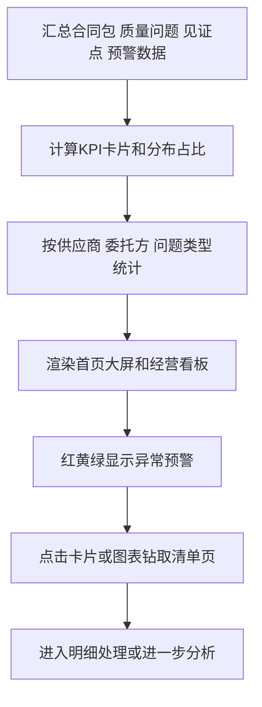

## 6. 日常工作量化管理

覆盖需求：`22 日常工作量化管理`

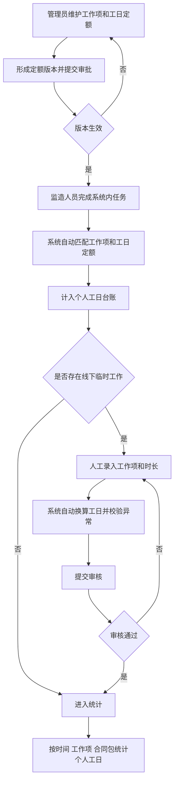

## 7. 产品二维码

覆盖需求：`23 产品二维码`

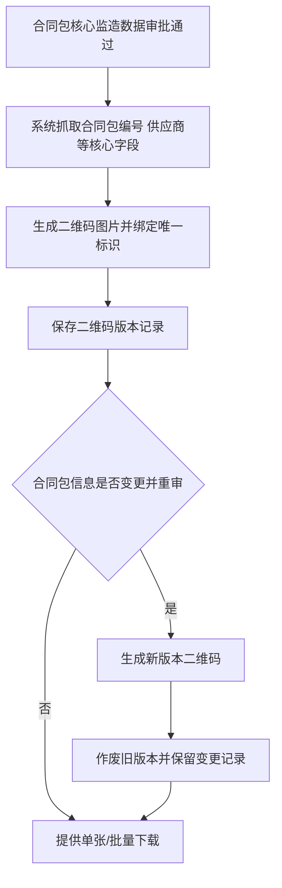

## 8. 电子签名

覆盖需求：`24 电子签名`

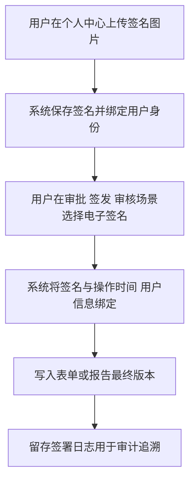

## 9. 图文识别信息抓取

覆盖需求：`25 图文识别信息抓取`

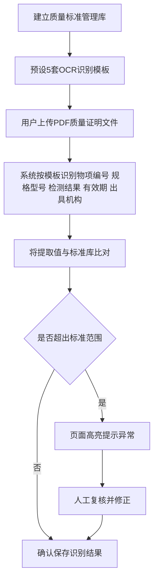

## 10. 视频远程识别

覆盖需求：`26 视频远程识别`

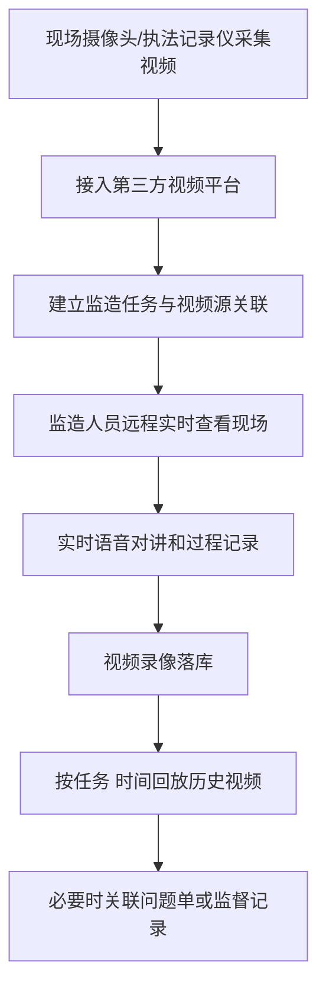

## 11. 数据信息资源库及AI识别功能

覆盖需求：`27 数据信息资源库及AI识别功能`

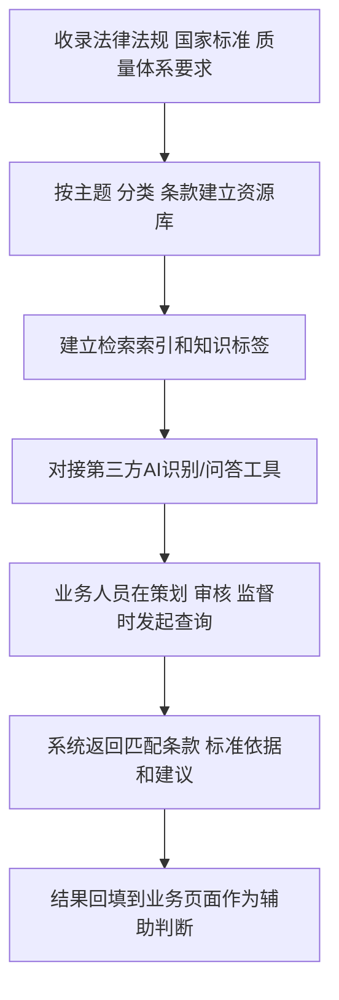

## 12. 付款台账

覆盖需求：`28 付款台账`

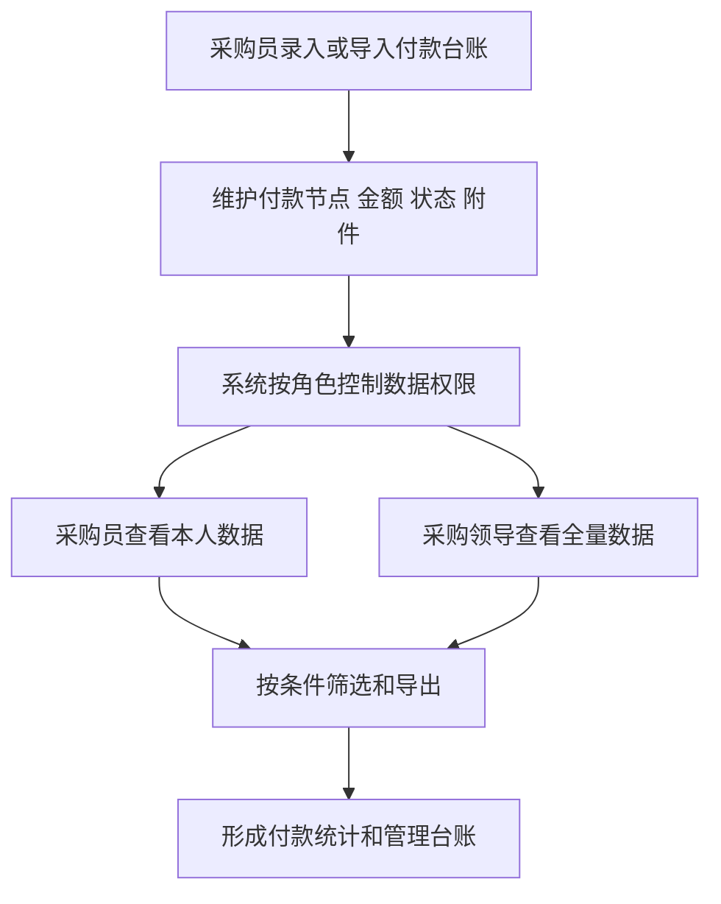

## 13. 培训与考试

覆盖需求：`29 培训与考试`

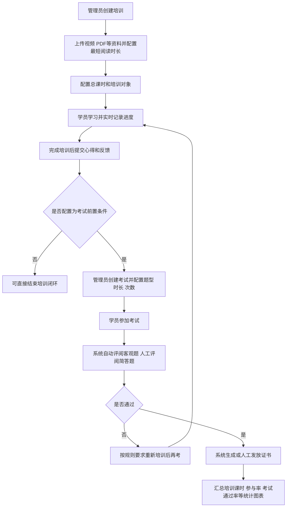
