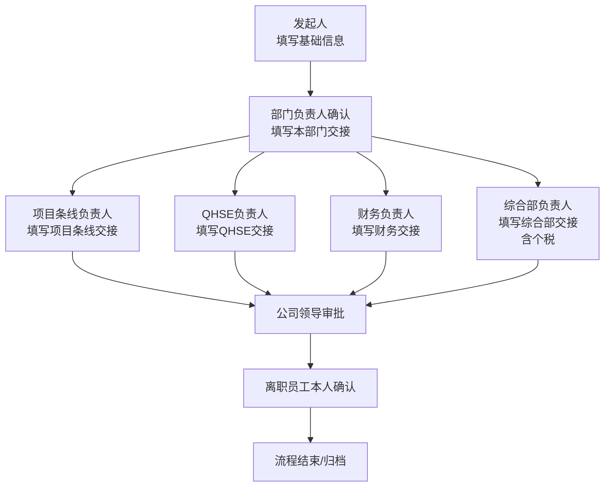
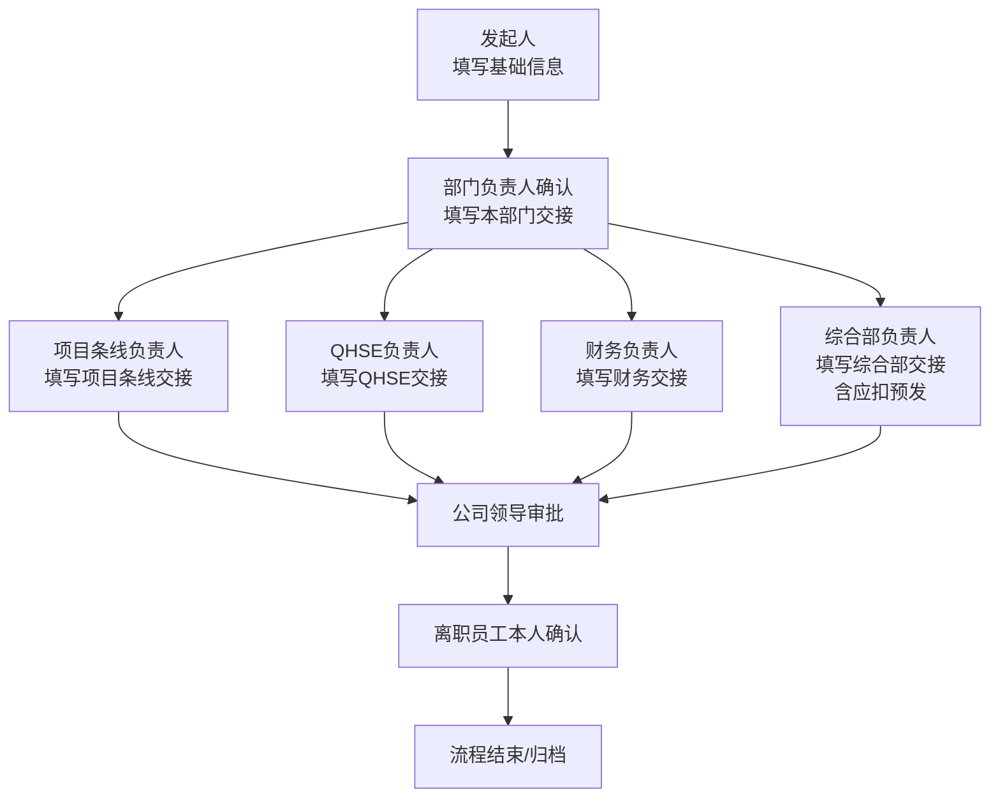
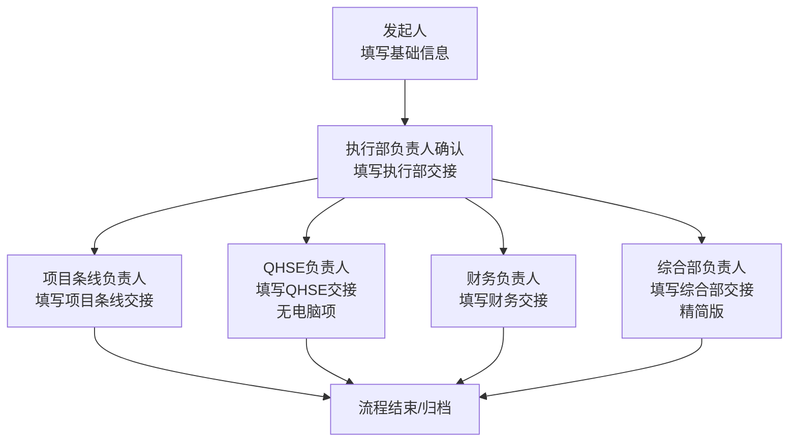

# 离职/转出申请统一表单与流程设计

## 1. 这次的设计目标

这次不是设计 `3` 张表单，而是：

- `1` 张统一表单
- 适配 `3` 份离职/转出模板
- 在泛微里通过 `显示属性联动 + 节点字段权限 + 不同流程定义` 来实现

推荐落地方式：

- 表单：只做 `1` 张，名称建议为 `离职/转出申请单`
- 流程：做 `3` 条，复用同一张表单

建议流程名称：

- `WF-LV-01 三方离职/转出流程（WP版）`
- `WF-LV-02 三方离职/转出流程（正式版）`
- `WF-LV-03 中化方胜离职/转出流程`

这样做的原因：

- 你要的是 `一个表单`，不是 `一个流程`
- 三方 `WP版` 和 `正式版` 表单结构几乎一致，但你又明确要求“不同工作流程给具体流程图”，那最清晰的做法就是 `同表单 + 分流程`
- 中化方胜版字段和末尾节点明显更精简，单独做流程定义更直观

## 2. 三个模板的适配关系

| 流程 | 对应模板 | 表单差异 | 流程差异 |
| --- | --- | --- | --- |
| `WF-LV-01` | `职工离职结算单三方wp20251208.doc` | 综合部显示 `个税` | 含 `公司领导审批`、`本人确认` |
| `WF-LV-02` | `职工离职结算单三方正式20251208.doc` | 综合部显示 `应扣预发` | 含 `公司领导审批`、`本人确认` |
| `WF-LV-03` | `中化方胜离职结算单20251222.doc` | 本部门显示为 `执行部`；QHSE不显示 `电脑`；综合部只显示精简事项 | 不含 `公司领导审批`、`本人确认` |

## 3. 表单总体布局建议

表单布局建议按你出差单截图的思路去做，分成固定区块：

1. `基本信息`
2. `离职人员信息`
3. `流程控制信息`
4. `本部门/执行部交接`
5. `项目条线交接`
6. `QHSE交接`
7. `财务交接`
8. `综合部交接`
9. `审批信息`
10. `归档信息`

其中：

- `基本信息`、`离职人员信息` 主要由发起人填写
- `交接区块` 主要由各审批节点填写
- `流程控制信息` 建议大部分隐藏，仅作为联动和流程路由控制使用
- `归档信息` 建议系统自动回写

## 4. 统一表单字段清单

下面是建议直接用于泛微配置的字段清单。字段编码是建议值，你可以照这个思路命名。

### 4.1 基本信息

| 字段编码 | 字段名称 | 控件类型 | 是否必填 | 默认权限 | 说明 |
| --- | --- | --- | --- | --- | --- |
| `process_no` | 流程编号 | 单行文本 | 否 | 只读 | 系统自动生成 |
| `workflow_name` | 流程名称 | 单行文本 | 否 | 只读 | 系统自动带出当前流程定义 |
| `applicant_name` | 申请人 | 人员单选 | 否 | 只读 | 系统自动带出 |
| `apply_date` | 申请时间 | 日期时间 | 否 | 只读 | 系统自动带出 |
| `applicant_dept` | 申请人所属部门 | 组织单选 | 否 | 只读 | 系统自动带出 |
| `applicant_company` | 申请人所属公司 | 单行文本/下拉 | 否 | 只读 | 系统自动带出 |
| `template_type` | 模板类型 | 下拉框 | 是 | 隐藏或只读 | 由流程默认带出：`三方-WP` / `三方-正式` / `中化方胜` |
| `biz_type` | 业务类型 | 下拉框 | 是 | 编辑 | `离职` / `转出` |
| `initiate_mode` | 发起方式 | 下拉框 | 是 | 编辑 | `本人发起` / `代发起` |
| `proxy_reason` | 代发起原因 | 多行文本 | 否 | 编辑 | 当 `initiate_mode=代发起` 时显示并必填 |

### 4.2 离职人员信息

| 字段编码 | 字段名称 | 控件类型 | 是否必填 | 默认权限 | 说明 |
| --- | --- | --- | --- | --- | --- |
| `employee_name` | 离职/转出人员姓名 | 人员单选或单行文本 | 是 | 编辑 | 建议可选人，也可手输 |
| `employee_no` | 员工编号 | 单行文本 | 否 | 编辑/只读 | 有主数据就自动带出 |
| `employee_company` | 所属公司/用工主体 | 下拉框 | 是 | 编辑 | 如南京三方、中化方胜 |
| `employee_dept` | 所属部门 | 组织单选或单行文本 | 是 | 编辑 | 中化方胜流程下可显示为实际归属部门 |
| `job_title` | 岗位 | 单行文本 | 是 | 编辑 | 对应模板中的岗位 |
| `dispatch_project` | 派驻单位/项目 | 单行文本 | 否 | 编辑 | 中化方胜流程下建议必填 |
| `onboard_date` | 到岗时间 | 日期 | 是 | 编辑 | 对应模板中的到岗时间 |
| `last_work_date` | 最后工作日 | 日期 | 是 | 编辑 | 方便流程时限控制 |
| `leave_date` | 离职/转出日期 | 日期 | 是 | 编辑 | 对应模板中的离职/转出时间 |
| `leave_reason` | 事由 | 下拉框 | 是 | 编辑 | `合同到期`、`辞职`、`解除聘用`、`转出`、`其他` |
| `leave_reason_other` | 其他原因说明 | 多行文本 | 否 | 编辑 | 当 `leave_reason=其他` 时显示并必填 |
| `handover_summary` | 申请人补充说明 | 多行文本 | 否 | 编辑 | 发起人对交接事项的整体说明 |
| `contact_mobile` | 联系电话 | 单行文本 | 否 | 编辑 | 便于离职后补充材料 |
| `attachment_file` | 附件 | 附件 | 否 | 编辑 | 申请说明、证明、补充材料等 |

### 4.3 流程控制字段

这些字段建议隐藏，不给业务人员主动填，用于联动和流程控制。

| 字段编码 | 字段名称 | 控件类型 | 是否必填 | 默认权限 | 说明 |
| --- | --- | --- | --- | --- | --- |
| `ctrl_main_section_name` | 主部门区块名称 | 单行文本 | 否 | 隐藏 | 值为 `本部门` 或 `执行部` |
| `ctrl_comp_settlement_mode` | 综合部结算模式 | 单行文本 | 否 | 隐藏 | 值为 `个税` / `应扣预发` / `精简版` |
| `ctrl_show_company_leader` | 是否显示公司领导节点 | 单选框 | 否 | 隐藏 | `是/否` |
| `ctrl_show_employee_confirm` | 是否显示本人确认节点 | 单选框 | 否 | 隐藏 | `是/否` |
| `ctrl_show_qhse_pc` | 是否显示QHSE电脑项 | 单选框 | 否 | 隐藏 | `是/否` |
| `ctrl_need_dispatch_project` | 派驻单位/项目是否必填 | 单选框 | 否 | 隐藏 | `是/否` |
| `archive_status` | 归档状态 | 单行文本 | 否 | 只读 | `草稿`、`审批中`、`已完成`、`已作废` |
| `archive_time` | 归档时间 | 日期时间 | 否 | 只读 | 流程结束时回写 |

## 5. 五个交接区块的子表设计

建议五个区块全部做成 `子表`，每个子表字段结构一致，这样权限和联动最好配。

### 5.1 子表通用字段

| 子表字段编码 | 子表字段名称 | 控件类型 | 说明 |
| --- | --- | --- | --- |
| `item_name` | 交接事项 | 单行文本 | 系统预置，不允许审批人改字段名 |
| `is_involved` | 是否涉及 | 单选框 | `是` / `否` |
| `handover_content` | 交接内容 | 多行文本 | 处理节点填写 |
| `handover_to` | 交接人 | 人员单选/单行文本 | 处理节点填写 |
| `handover_date` | 日期 | 日期 | 处理节点填写 |
| `handover_result` | 处理结果 | 下拉框 | `已完成` / `不涉及` / `待补充` |
| `handover_remark` | 备注 | 多行文本 | 处理节点填写 |

### 5.2 本部门/执行部交接子表 `dt_main_dept`

固定行建议如下：

- `驻厂工作`
- `部门文件资料`
- `办公设备`
- `部门内设备`
- `其它`

联动规则：

- `WF-LV-01`、`WF-LV-02`：区块标题显示为 `本部门交接`
- `WF-LV-03`：区块标题显示为 `执行部交接`

### 5.3 项目条线交接子表 `dt_project_line`

固定行建议如下：

- `项目管理工作`

### 5.4 QHSE交接子表 `dt_qhse`

固定行建议如下：

- `培训金签退`
- `资质证书`
- `电脑`
- `仪器设备`
- `智能安全帽`
- `其他`

联动规则：

- `WF-LV-01`、`WF-LV-02`：显示全部固定行
- `WF-LV-03`：隐藏 `电脑`

### 5.5 财务交接子表 `dt_finance`

固定行建议如下：

- `欠款清理`
- `财务清算`
- `其它`

### 5.6 综合部交接子表 `dt_admin`

建议把可能出现的事项一次性全部预置到子表里，然后通过显示联动控制显示/隐藏。

全部预置项建议如下：

- `钥匙/卡`
- `工资发放`
- `个税`
- `应扣预发`
- `合同解除`
- `档案调出`
- `保险手续`
- `退群（微信钉钉）`
- `离职体检报告`
- `邮箱、平台禁用`
- `告知各部门`

联动规则：

- `WF-LV-01`：显示 `个税`，隐藏 `应扣预发`、`告知各部门`
- `WF-LV-02`：显示 `应扣预发`，隐藏 `个税`、`告知各部门`
- `WF-LV-03`：只显示 `退群（微信钉钉）`、`离职体检报告`、`邮箱、平台禁用`、`告知各部门`；其余全部隐藏

## 6. 发起人需要填写哪些字段

这个部分单独列出来，方便你直接配发起节点权限。

### 6.1 发起节点可编辑字段

| 字段编码 | 字段名称 | 是否必填 | 备注 |
| --- | --- | --- | --- |
| `biz_type` | 业务类型 | 是 | 离职/转出 |
| `initiate_mode` | 发起方式 | 是 | 本人发起/代发起 |
| `proxy_reason` | 代发起原因 | 条件必填 | 仅代发起时必填 |
| `employee_name` | 离职/转出人员姓名 | 是 | 申请的对象 |
| `employee_no` | 员工编号 | 否 | 有系统主数据则自动带出 |
| `employee_company` | 所属公司/用工主体 | 是 | 南京三方/中化方胜等 |
| `employee_dept` | 所属部门 | 是 | 员工归属部门 |
| `job_title` | 岗位 | 是 | 当前岗位 |
| `dispatch_project` | 派驻单位/项目 | 条件必填 | 中化方胜流程建议必填 |
| `onboard_date` | 到岗时间 | 是 | |
| `last_work_date` | 最后工作日 | 是 | |
| `leave_date` | 离职/转出日期 | 是 | |
| `leave_reason` | 事由 | 是 | |
| `leave_reason_other` | 其他原因说明 | 条件必填 | 仅“其他”时必填 |
| `handover_summary` | 申请人补充说明 | 否 | |
| `contact_mobile` | 联系电话 | 否 | |
| `attachment_file` | 附件 | 否 | |

### 6.2 发起节点只读字段

| 字段编码 | 字段名称 | 说明 |
| --- | --- | --- |
| `process_no` | 流程编号 | 系统自动生成 |
| `workflow_name` | 流程名称 | 系统带出 |
| `applicant_name` | 申请人 | 系统带出 |
| `apply_date` | 申请时间 | 系统带出 |
| `applicant_dept` | 申请人所属部门 | 系统带出 |
| `applicant_company` | 申请人所属公司 | 系统带出 |
| `template_type` | 模板类型 | 建议由流程默认写入，发起人不改 |

## 7. 各审批节点要填写哪些字段

下面这个部分就是你要的“每个审批流下的人在处理时要填写什么字段”。

### 7.1 `WF-LV-01` / `WF-LV-02` 共用的节点字段权限

| 节点 | 处理人来源 | 可编辑字段 | 说明 |
| --- | --- | --- | --- |
| 发起人 | 发起人本人 | 见第 `6` 章 | 只填基础信息，不填部门交接结果 |
| 部门负责人确认 | `employee_dept` 对应部门负责人 | `dt_main_dept[*].is_involved`、`dt_main_dept[*].handover_content`、`dt_main_dept[*].handover_to`、`dt_main_dept[*].handover_date`、`dt_main_dept[*].handover_result`、`dt_main_dept[*].handover_remark`、`dept_manager_opinion` | 负责本部门交接确认 |
| 项目条线处理 | 根据 `dispatch_project` 或项目条线映射取负责人 | `dt_project_line[*].is_involved`、`dt_project_line[*].handover_content`、`dt_project_line[*].handover_to`、`dt_project_line[*].handover_date`、`dt_project_line[*].handover_result`、`dt_project_line[*].handover_remark`、`project_line_opinion` | 负责项目条线交接 |
| QHSE处理 | QHSE固定岗位/负责人 | `dt_qhse[*].is_involved`、`dt_qhse[*].handover_content`、`dt_qhse[*].handover_to`、`dt_qhse[*].handover_date`、`dt_qhse[*].handover_result`、`dt_qhse[*].handover_remark`、`qhse_opinion` | 负责QHSE交接 |
| 财务处理 | 财务固定岗位/负责人 | `dt_finance[*].is_involved`、`dt_finance[*].handover_content`、`dt_finance[*].handover_to`、`dt_finance[*].handover_date`、`dt_finance[*].handover_result`、`dt_finance[*].handover_remark`、`finance_opinion` | 负责财务交接 |
| 综合部处理 | 综合部固定岗位/负责人 | `dt_admin[*].is_involved`、`dt_admin[*].handover_content`、`dt_admin[*].handover_to`、`dt_admin[*].handover_date`、`dt_admin[*].handover_result`、`dt_admin[*].handover_remark`、`admin_opinion` | `WF-LV-01` 处理 `个税`，`WF-LV-02` 处理 `应扣预发` |
| 公司领导审批 | 指定岗位/公司领导 | `company_leader_decision`、`company_leader_opinion` | 只审批，不改交接子表 |
| 本人确认 | `employee_name` 对应账号 | `employee_confirm_result`、`employee_confirm_date`、`employee_confirm_remark` | 仅做本人确认 |

建议为上述审批意见字段新增以下主表字段：

- `dept_manager_opinion`
- `project_line_opinion`
- `qhse_opinion`
- `finance_opinion`
- `admin_opinion`
- `company_leader_decision`
- `company_leader_opinion`
- `employee_confirm_result`
- `employee_confirm_date`
- `employee_confirm_remark`

### 7.2 `WF-LV-03 中化方胜流程` 的节点字段权限

| 节点 | 处理人来源 | 可编辑字段 | 说明 |
| --- | --- | --- | --- |
| 发起人 | 发起人本人 | 见第 `6` 章 | 同统一发起字段 |
| 执行部负责人确认 | 执行部负责人 | `dt_main_dept[*].is_involved`、`dt_main_dept[*].handover_content`、`dt_main_dept[*].handover_to`、`dt_main_dept[*].handover_date`、`dt_main_dept[*].handover_result`、`dt_main_dept[*].handover_remark`、`dept_manager_opinion` | 区块名称显示为 `执行部交接` |
| 项目条线处理 | 根据派驻单位/项目映射 | `dt_project_line[*].is_involved`、`dt_project_line[*].handover_content`、`dt_project_line[*].handover_to`、`dt_project_line[*].handover_date`、`dt_project_line[*].handover_result`、`dt_project_line[*].handover_remark`、`project_line_opinion` | 同三方流程 |
| QHSE处理 | QHSE固定岗位/负责人 | `dt_qhse[*].is_involved`、`dt_qhse[*].handover_content`、`dt_qhse[*].handover_to`、`dt_qhse[*].handover_date`、`dt_qhse[*].handover_result`、`dt_qhse[*].handover_remark`、`qhse_opinion` | 其中 `电脑` 行隐藏 |
| 财务处理 | 财务固定岗位/负责人 | `dt_finance[*].is_involved`、`dt_finance[*].handover_content`、`dt_finance[*].handover_to`、`dt_finance[*].handover_date`、`dt_finance[*].handover_result`、`dt_finance[*].handover_remark`、`finance_opinion` | 同三方流程 |
| 综合部处理 | 综合部固定岗位/负责人 | `dt_admin[*].is_involved`、`dt_admin[*].handover_content`、`dt_admin[*].handover_to`、`dt_admin[*].handover_date`、`dt_admin[*].handover_result`、`dt_admin[*].handover_remark`、`admin_opinion` | 仅处理精简后的 `4` 个事项 |

这个流程默认不配置以下节点：

- `公司领导审批`
- `本人确认`

## 8. 显示属性联动怎么配

这个部分就是基于你给的“显示属性联动”截图来写的，可以直接作为联动清单去配。

### 8.1 流程级联动

| 联动编号 | 触发条件 | 变更对象 | 动作 |
| --- | --- | --- | --- |
| `L01` | 当前流程 = `WF-LV-01` | `template_type` | 默认值写 `三方-WP`，设为只读或隐藏 |
| `L02` | 当前流程 = `WF-LV-01` | `ctrl_main_section_name` | 写入 `本部门` |
| `L03` | 当前流程 = `WF-LV-01` | `ctrl_comp_settlement_mode` | 写入 `个税` |
| `L04` | 当前流程 = `WF-LV-01` | `ctrl_show_company_leader`、`ctrl_show_employee_confirm`、`ctrl_show_qhse_pc` | 全部写 `是` |
| `L05` | 当前流程 = `WF-LV-02` | `template_type` | 默认值写 `三方-正式`，设为只读或隐藏 |
| `L06` | 当前流程 = `WF-LV-02` | `ctrl_main_section_name` | 写入 `本部门` |
| `L07` | 当前流程 = `WF-LV-02` | `ctrl_comp_settlement_mode` | 写入 `应扣预发` |
| `L08` | 当前流程 = `WF-LV-02` | `ctrl_show_company_leader`、`ctrl_show_employee_confirm`、`ctrl_show_qhse_pc` | 全部写 `是` |
| `L09` | 当前流程 = `WF-LV-03` | `template_type` | 默认值写 `中化方胜`，设为只读或隐藏 |
| `L10` | 当前流程 = `WF-LV-03` | `ctrl_main_section_name` | 写入 `执行部` |
| `L11` | 当前流程 = `WF-LV-03` | `ctrl_comp_settlement_mode` | 写入 `精简版` |
| `L12` | 当前流程 = `WF-LV-03` | `ctrl_show_company_leader`、`ctrl_show_employee_confirm` | 全部写 `否` |
| `L13` | 当前流程 = `WF-LV-03` | `ctrl_show_qhse_pc`、`ctrl_need_dispatch_project` | `ctrl_show_qhse_pc=否`，`ctrl_need_dispatch_project=是` |

### 8.2 字段级联动

| 联动编号 | 触发条件 | 变更对象 | 动作 |
| --- | --- | --- | --- |
| `L21` | `initiate_mode=代发起` | `proxy_reason` | 显示 + 必填 |
| `L22` | `initiate_mode!=代发起` | `proxy_reason` | 隐藏 |
| `L23` | `leave_reason=其他` | `leave_reason_other` | 显示 + 必填 |
| `L24` | `leave_reason!=其他` | `leave_reason_other` | 隐藏 |
| `L25` | `ctrl_need_dispatch_project=是` | `dispatch_project` | 必填 |
| `L26` | `ctrl_need_dispatch_project=否` | `dispatch_project` | 非必填 |

### 8.3 子表行联动

这个部分是关键，正好对应你给的“隐藏行/隐藏字段”的能力。

| 联动编号 | 触发条件 | 变更对象 | 动作 |
| --- | --- | --- | --- |
| `L31` | `template_type=三方-WP` | `dt_admin.个税` | 显示 |
| `L32` | `template_type=三方-WP` | `dt_admin.应扣预发`、`dt_admin.告知各部门` | 隐藏行 |
| `L33` | `template_type=三方-正式` | `dt_admin.应扣预发` | 显示 |
| `L34` | `template_type=三方-正式` | `dt_admin.个税`、`dt_admin.告知各部门` | 隐藏行 |
| `L35` | `template_type=中化方胜` | `dt_qhse.电脑` | 隐藏行 |
| `L36` | `template_type=中化方胜` | `dt_admin.退群（微信钉钉）`、`dt_admin.离职体检报告`、`dt_admin.邮箱、平台禁用`、`dt_admin.告知各部门` | 显示 |
| `L37` | `template_type=中化方胜` | `dt_admin.钥匙/卡`、`dt_admin.工资发放`、`dt_admin.个税`、`dt_admin.应扣预发`、`dt_admin.合同解除`、`dt_admin.档案调出`、`dt_admin.保险手续` | 隐藏行 |

## 9. 三条流程图

下面这部分就是你要的“不同工作流程的具体流程图”。

### 9.1 `WF-LV-01 三方离职/转出流程（WP版）`

特点：

- 使用统一表单
- 综合部显示 `个税`
- 走 `公司领导审批`
- 走 `本人确认`

### 9.2 `WF-LV-02 三方离职/转出流程（正式版）`

特点：

- 使用统一表单
- 综合部显示 `应扣预发`
- 走 `公司领导审批`
- 走 `本人确认`

### 9.3 `WF-LV-03 中化方胜离职/转出流程`

特点：

- 使用统一表单
- 本部门区块改名为 `执行部`
- QHSE不显示 `电脑`
- 综合部只显示 `退群（微信钉钉）`、`离职体检报告`、`邮箱、平台禁用`、`告知各部门`
- 不走 `公司领导审批`
- 不走 `本人确认`

## 10. 最终落地建议

如果你现在要在泛微里真正开配，我建议按下面这个口径执行：

1. 只做 `1` 张表单，名字就叫 `离职/转出申请单`
2. 同一张表单挂 `3` 条流程
3. `模板类型` 不给申请人选，由不同流程入口自动写入
4. `5` 个交接区块全部用子表，并预置固定事项
5. 用 `显示属性联动` 去控制：
   - 区块标题是 `本部门` 还是 `执行部`
   - 综合部显示 `个税` 还是 `应扣预发`
   - 中化方胜是否隐藏若干交接行
   - 是否显示 `公司领导审批`、`本人确认` 相关字段
6. 节点权限按“谁处理谁编辑本节点字段，其他全部只读”来配

如果后面你还要，我下一步可以继续帮你把这份文档再落成两张更适合实施的清单：

- `泛微字段配置台账`
- `泛微流程节点权限台账`
