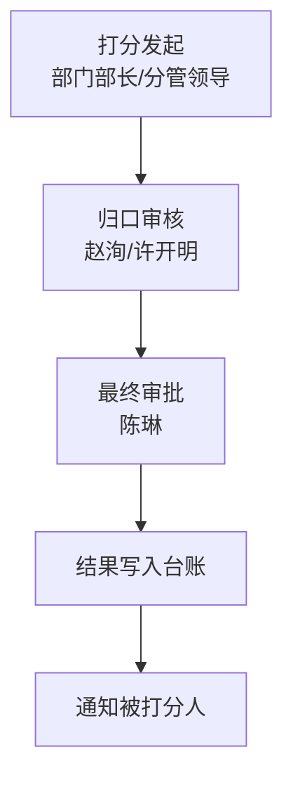

# 综合管理平台绩效考核配置说明

## 1. 文档目标

本文用于将 `南京三方部门月度绩效考核标准.xlsx` 翻译成综合管理平台可落地的配置方案，解决以下问题：

- 让业务人员理解 Excel 中每一行规则在平台里分别代表什么。
- 明确系统中应该建设哪些对象：规则库、打分流程、台账、报表。
- 明确推荐的落地方式，避免把 Excel 直接硬搬成一张大表单。

本文适用环境：

- `e-cology10`
- `e-mobile10`
- 已具备：表单建模、流程引擎、数据建模、报表能力

## 2. 对原始 Excel 的理解

原始 Excel 共有 2 个 sheet：

- `加分`
- `扣分`

这两个 sheet 本质上都不是“技术配置表”，而是**绩效规则清单**。每一行都表达一条规则，核心含义如下：

- 这条规则归属哪个部门
- 这条规则归属哪个条线
- 这条规则适用于哪个岗位
- 什么行为触发加分或扣分
- 在什么附加条件下触发
- 加分或扣分的计算方式是什么

### 2.1 各列的业务含义

| Excel 列   | 业务含义   | 在系统里的角色     |
| --------- | ------ | ----------- |
| 部门        | 规则归属部门 | 规则筛选条件      |
| 条线        | 规则归属条线 | 规则筛选条件      |
| 序号        | 规则顺序号  | 仅展示/排序      |
| 岗位/如有     | 规则适用岗位 | 规则筛选条件      |
| 细分事项      | 触发事件说明 | 规则名称/规则正文   |
| 附加事项      | 补充条件   | 规则补充说明      |
| 加分规则/扣分规则 | 分值计算方式 | 系统计算或人工录入依据 |

### 2.2 这份表不是在表达什么

这份 Excel **不是**在表达：

- 页面布局长什么样
- 哪个字段放哪一行
- 哪个按钮点哪里
- 哪个接口怎么调用

它表达的是：

**“绩效考核时，可用的标准化打分规则有哪些。”**

因此系统落地不能简单理解为“做一张 Excel 同款录入表”，而应拆成：

1. `绩效规则库`
2. `绩效打分审批流程`
3. `月度汇总台账`
4. `审批日志与通知`

## 3. 推荐落地思路

## 3.1 推荐方案

推荐采用：

**规则库 + 事件式打分单 + 月度汇总台账**

而不是：

**一个月只提一张大汇总表，里面塞很多人很多规则**

### 推荐原因

- 一条打分事件对应一条流程，责任和证据清晰
- 审批链条简单，容易追溯
- 被打分人通知更自然
- 月度统计可以由台账自动汇总，不需要人工反复汇总
- 后续报表、排名、分析维度更容易做

## 3.2 平台对象设计

| 对象       | 类型        | 用途              | 数据来源            |
| -------- | --------- | --------------- | --------------- |
| 绩效规则库    | 数据建模基础表   | 存放加分/扣分标准       | 由 Excel 导入或人工维护 |
| 绩效打分单    | 流程表单      | 发起一条具体加分/扣分事件   | 部门负责人/分管领导填写    |
| 月度绩效汇总台账 | 数据建模/报表   | 汇总个人或部门的月度加扣分结果 | 由已审批打分单自动汇总     |
| 审批日志台账   | 流程日志/数据建模 | 留痕每次审批动作        | 流程自动生成          |
| 通知记录     | 系统消息/待办   | 审批完成后通知被打分人     | 流程节点自动触发        |

## 4. 推荐业务流程

## 4.1 角色理解

依据原表顶部说明，建议流程角色如下：

- `打分人`：各部门部长、分管领导
- `审核人`：赵洵、许开明
- `审批人`：陈琳
- `被打分人`：被考核员工

## 4.2 推荐流程

## 4.3 为什么不建议“月末一次性汇总审批”

如果每个部门每个月只提一张大汇总单，会有这些问题：

- 一张单里会出现很多员工、很多规则、很多证据
- 审批人不容易逐条判断真实性
- 被打分人接收通知时难以区分具体哪一条事件
- 后期如果要复核某一条扣分，追溯成本很高

因此更建议：

- **事件发生时发起打分**
- **月末自动汇总**

## 5. 规则库在系统里怎么理解

规则库不是流程单，而是基础主数据。你可以把 Excel 中每一行导入为一条规则记录。

### 5.1 规则库至少应包含的信息

- 规则类型：加分/扣分
- 归属部门
- 归属条线
- 适用岗位
- 细分事项
- 附加事项
- 规则说明
- 分值模型
- 是否启用

### 5.2 分值模型建议拆分

原表中的分值规则并不完全统一，建议在系统里拆成以下几类：

| 原表表现                | 建议系统模型         |
| ------------------- | -------------- |
| `每次加 2 分`           | 固定分值           |
| `每次扣 1 分`           | 固定分值           |
| `每次加 1-5 分`         | 区间分值           |
| `每次扣 5-15 分`        | 区间分值           |
| `每延迟 1 个工作日扣 0.5 分` | 按次数/按单位累乘      |
| `每10万1分，上限25分`      | 阶梯/公式型         |
| `每次扣15/30分`         | 分档型，需要人工选择严重程度 |

### 5.3 规则库的作用

在打分单里，发起人不应手写规则，而应：

1. 先选 `加分` 或 `扣分`
2. 再选部门、条线、岗位
3. 系统自动过滤可选规则
4. 发起人选择规则后，系统自动带出：
  - 细分事项
  - 附加事项
  - 分值规则
  - 是否要求附件

## 6. 打分单在系统里怎么用

推荐每张打分单只对应：

- 1 个被打分人
- 1 条规则
- 1 次打分事件

这样做的好处是：

- 审批逻辑简单
- 证据关联清晰
- 被打分人通知清晰
- 台账汇总容易

### 6.1 打分单要表达的核心信息

- 给谁打分
- 为什么打分
- 用的是哪条规则
- 实际给多少分
- 有什么证据
- 谁审核、谁审批
- 最终结果是什么

### 6.2 实际分值不一定完全自动

因为 Excel 中很多规则是区间值，比如：

- `每次加 1-5 分`
- `每次扣 5-15 分`
- `每次扣 2-8 分`

这类规则建议在系统中处理为：

- 规则库存 `最小值`、`最大值`
- 发起人在打分单里填写 `实际分值`
- 系统校验该分值必须落在允许区间内
- 审核/审批节点可调整或退回

## 7. 月度汇总台账怎么做

原 Excel 名称是“月度绩效考核标准”，但不代表必须人工做“月度大表”。

推荐做法：

- 所有审批通过的打分单自动写入“绩效事件台账”
- 再按月份自动汇总成“月度绩效汇总台账”

### 7.1 月度汇总的核心指标

建议至少汇总：

- 员工
- 所属部门
- 所属条线
- 考核月份
- 加分合计
- 扣分合计
- 净增减分
- 审批通过条数
- 最后更新时间

### 7.2 关于基础分

原 Excel 没有明确写“基础分”或“最终绩效总分”的算法，因此建议分两步：

#### 方案 A：先只做净增减分

即：

- 加分总计
- 扣分总计
- 净增减分 = 加分合计 - 扣分合计

这种方式最稳，不依赖额外制度解释。

#### 方案 B：如果后续公司明确基础分口径

可扩展为：

- `最终绩效分 = 基础分 + 加分合计 - 扣分合计`

但该口径需要制度确认后再启用。

## 8. 这份 Excel 在平台里要拆成哪些配置动作

## 8.1 第一部分：导入规则库

把 Excel 两个 sheet 拆入规则库：

- `加分` sheet -> 规则类型 = 加分
- `扣分` sheet -> 规则类型 = 扣分

## 8.2 第二部分：配置打分审批流程

流程节点：

1. 发起打分
2. 归口审核
3. 最终审批
4. 自动写台账
5. 自动通知被打分人

## 8.3 第三部分：配置台账和报表

至少配置：

- 绩效规则库台账
- 绩效事件台账
- 月度汇总台账
- 审批日志查询
- 员工个人绩效明细查询

## 9. 推荐权限边界

## 9.1 规则库维护权限

建议仅开放给：

- 综合部/人事条线
- 制度管理员
- 指定系统管理员

普通业务部门只可查询，不可修改规则。

## 9.2 打分权限

依据原表说明，建议开放给：

- 各部门部长
- 分管领导

## 9.3 审核权限

- 赵洵
- 许开明

## 9.4 审批权限

- 陈琳

## 9.5 查询权限

- 被打分人可查自己的记录
- 部门负责人可查本部门记录
- 综合部/HR 可查全量记录

## 10. 当前方案中的关键假设

以下内容在本方案中做了默认假设，如后续制度另有规定，可再调整：

1. 每张打分单只对应一个员工和一条规则
2. 月度结果由已审批事件自动汇总，不人工录总表
3. 区间分值规则允许发起人填写实际分值，但必须在规则区间内
4. 需要证据的事项应支持上传附件
5. 基础分暂不在本期内强制纳入计算

## 11. 你在平台里真正要做的，不是“照着 Excel 抄”

这份 Excel 真正的落地方式是：

- 先把它做成 **规则库**
- 再做成 **打分流程**
- 最后形成 **汇总台账和报表**

换句话说：

**Excel 是制度来源，平台才是执行载体。**

## 12. 下一份文档说明

配套的下一份文档 `字段清单 + 流程节点权限 + 台账设计.md` 会进一步给出：

- 推荐字段编码
- 每个字段的控件类型、是否必填、是否只读
- 各节点可编辑字段
- 台账表头设计
- 自动回写和汇总口径

