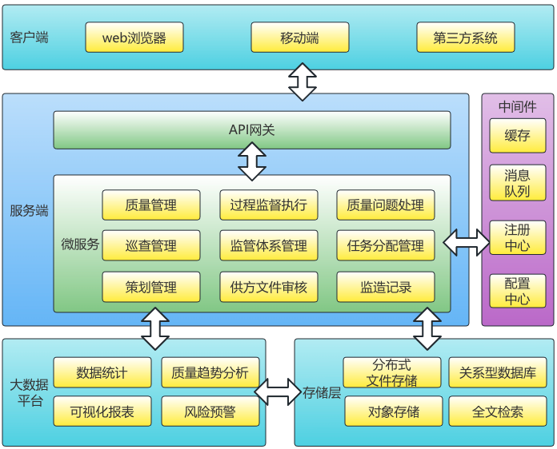
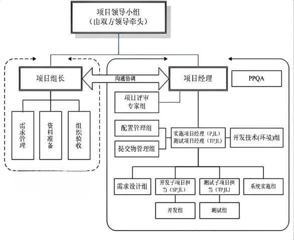
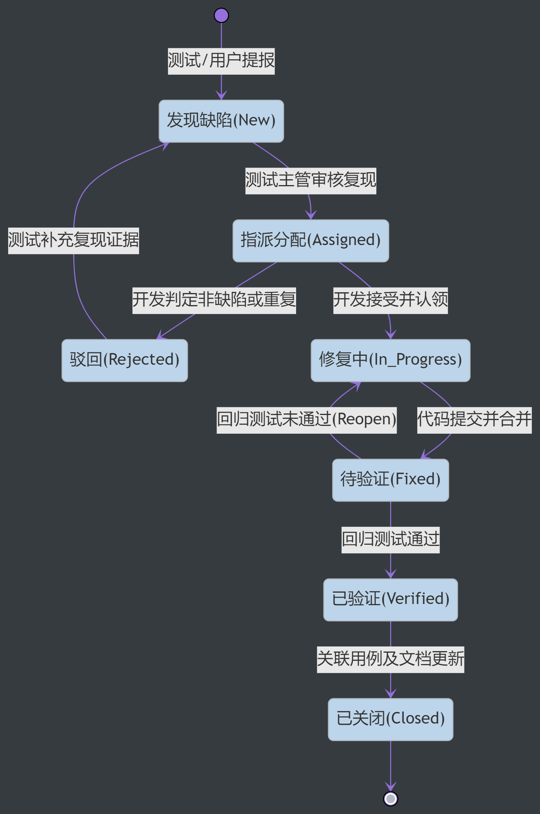
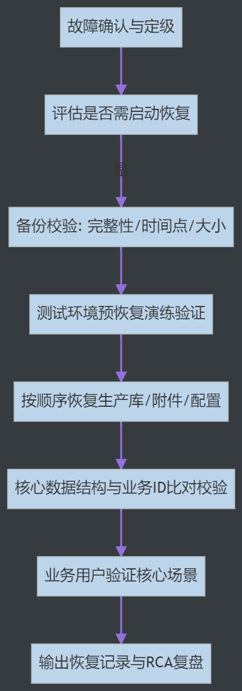

# 监造信息化系统项目技术方案

## 编制说明

本套章节稿不是简单对原始技术方案做“润色”，而是按招标评分逻辑、按评委阅读习惯、按正式技术标写法重新组织的详细版正文。编写过程中主要遵循以下四项原则：

1. 以 [监造信息化系统项目技术方案-20260519.docx](</D:/DevelopmentLocation/agent skill/skills/word_project/2026/2026-05-07/监造信息化系统项目技术方案-20260519.docx>) 为内容底稿，尽量复用其现有业务、架构、实施、质量、安全和服务内容，不凭空改造项目边界。
2. 以 [响应文件第七章第六点-技术方案正式稿-模板(写的很详细版本).docx](</D:/DevelopmentLocation/agent skill/skills/word_project/2026/2026-05-07/响应文件第七章第六点-技术方案正式稿-模板(写的很详细版本).docx>) 为写法参考，重点学习其“章节颗粒度、正文展开方式、评分索引、矩阵映射、章节前后衔接和评委取证路径”。
3. 以 [招标文件（脱敏版）(3).docx](</D:/DevelopmentLocation/agent skill/skills/word_project/2026/2026-05-07/招标文件（脱敏版）(3).docx>) 的功能条款、技术条款、服务条款和评分标准为最终口径，凡原始方案与招标口径不一致处，一律按招标要求重写。
4. 对于当前材料中无法真实补齐的客观高分证明项，一律使用 `[此处替换文字为xxx]` 方式占位，方便后续补证，不编造证书、案例、视频或团队证明。

## 本套章节稿使用方式

建议按以下顺序使用本套文件：

1. 先阅读 `01-评分响应索引.md`，明确评分项和章节之间的对应关系。
2. 再逐章修改 `02` 至 `09` 文件，把你手头已有的真实材料、截图、图片、图纸和案例逐项补进。
3. 最后统一处理 `10-证明材料与待补清单.md` 中的占位项，确保所有 `[此处替换文字为xxx]` 被真实内容替换。
4. 全部章节确认后，再生成汇总版总稿，进入排版和投标装订阶段。

## 本稿与原始底稿的关系说明

原始底稿的优点在于：

1. 架构、功能、质量、安全和交付方面已有比较完整的技术说明基础。
2. 体系文件、任务分配、监造策划、质量计划、见证执行、问题处理、验收放行、追溯分析等模块逻辑总体成形。
3. CMMI5 过程化质量管理、安全合规、知识产权和交付保障章节已有较强内容素材。

原始底稿的主要问题在于：

1. 没有按评分项正面组织正文，评委找不到得分点。
2. `12个月质保`、`不少于2名驻场` 等原口径与招标文件 `T1+24个月`、`至少6个月现场技术支持` 存在明显差异。
3. `两套逻辑隔离数据接入模块`、`视频远程识别`、`AI基础识别`、`本地化服务团队`、`成功案例视频` 等高分点没有显性展开。
4. 项目经理 `PMP`、高级职称、案例合同与验收、软著/专利、本地化服务团队证明等客观证据缺位，正文与附件无法形成闭环。

因此，本套章节稿的目标非常明确：

1. 让这份技术方案从“技术说明书”转成“评分导向型技术标正文”。
2. 让评委能在有限时间内迅速定位到每一个评分项的响应内容。
3. 让你后续补资料时有明确的落点、明确的插图位置、明确的替换口径。

## 图片与图示处理说明

本次重构已从原始 `docx` 中提取出以下 4 张现成图片，分别在对应章节中直接引用：

1. `source-images/image1.png`：系统总体架构图
2. `source-images/image2.png`：项目组织结构图
3. `source-images/image3.png`：缺陷闭环流程图
4. `source-images/image4.png`：备份恢复流程图

除此之外，凡模板里通常应有但原始底稿没有提供的图片、原型图、流程图、拓扑图，本稿统一使用如下格式保留位置：

`[插图占位：此处插入xxx图]`

这样处理的目的不是偷懒，而是为了让后续排版时能精确知道哪些地方必须补图、补图后会增强哪个评分项。

## 文件目录

本套章节稿共分为以下文件：

1. `00-编制说明.md`
2. `01-评分响应索引.md`
3. `02-项目整体响应与功能规格说明.md`
4. `03-性能指标实现方案.md`
5. `04-技术架构设计方案.md`
6. `05-项目实施计划与组织保障.md`
7. `06-质量管控与验收交付方案.md`
8. `07-安全与合规保障方案.md`
9. `08-维护服务与SLA保障方案.md`
10. `09-知识产权与项目交付保障.md`
11. `10-证明材料与待补清单.md`

在这套文件全部写实、补实后，才能合并为最终版总稿。


---

# 评分响应索引

## 一、评分响应索引编制说明

本项目技术评分不是看“章节多不多”，而是看“评分点是否命中、证据是否清晰、承诺是否一致、表达是否便于打分”。因此，在正式正文前单独设置评分响应索引，是高分技术标的基础动作，不是形式化动作。

本索引的设计目的有三层：

1. 给评委一个“看哪里”的导航图，让评委不用在正文里反复翻找。
2. 给编标人一个“缺什么”的检查表，避免高分项写进正文却没有附件入口。
3. 给后续排版和补材料人员一个“补到哪里”的落点表，避免正文、附件、视频、截图脱节。

本索引编制时，特别遵循以下口径：

1. 正文响应口径以招标文件为准，原始底稿仅作为素材库。
2. 所有需客观证明的高分项，都设置“正文位置 + 附件位置”双入口。
3. 所有原始底稿与招标要求冲突的地方，都在本表中纠偏，不沿用错误口径。

## 二、技术评分项总索引

| 评分项 | 分值 | 评分关注点 | 本套章节稿对应文件 | 主要证明材料入口 |
| --- | --- | --- | --- | --- |
| 系统功能匹配度 | 10分 | 功能完整、业务贴合、模块逻辑清楚、数据处理与扩展能力强 | `02-项目整体响应与功能规格说明.md` | `10-证明材料与待补清单.md`、附录功能矩阵 |
| 技术方案可行性 | 15分 | 分布式架构、高并发、多现场在线、大数据量存储、成熟选型、安全设计 | `03-性能指标实现方案.md`、`04-技术架构设计方案.md` | 技术架构图、性能方案、国产化适配说明 |
| 项目实施能力 | 8分 | 项目经理资格、核心成员经验、实施计划、组织保障、沟通与风险机制 | `05-项目实施计划与组织保障.md` | 项目经理材料、核心成员材料、案例合同与验收 |
| 系统设计要求及成熟度 | 6分 | 平台成熟、自主知识产权、软著专利、AI能力 | `04-技术架构设计方案.md`、`09-知识产权与项目交付保障.md` | 软著/专利/标准/AI能力材料 |
| 进度与业绩演示 | 6分 | 进度计划详细、4个月具备试运行条件、成功案例视频 | `05-项目实施计划与组织保障.md`、`10-证明材料与待补清单.md` | 类似案例、合同验收、MP4视频 |
| 售后服务及运维 | 5分 | 本地化服务团队、现场技术支持、SLA、培训、巡检和持续优化 | `08-维护服务与SLA保障方案.md` | 本地团队证明、培训计划、SLA表 |

## 三、关键硬指标响应索引

本项目除了主观评分项，还存在一批“必须写死”的硬指标。如果这些指标写得模糊、漏写或者与原始底稿冲突，即使正文很长，也很难拿高分。

| 硬指标 | 招标要求口径 | 本套章节稿响应位置 | 当前处理原则 |
| --- | --- | --- | --- |
| 架构模式 | `B/S` 架构，支持移动办公，满足后续 `APP` 扩展 | `04-技术架构设计方案.md` | 明确写 `B/S + 移动办公预留` |
| 数据接入模块 | 两套相互独立且逻辑隔离的标准化数据接入模块 | `02-项目整体响应与功能规格说明.md` | 单列章节正面回应 |
| 数据库 | 自主可控高性能数据库 | `04-技术架构设计方案.md` | 保持达梦 `V8` 方向，并补真实选型说明 |
| 备份恢复 | `RTO≤2小时`、`RPO≤15分钟` | `03-性能指标实现方案.md`、`07-安全与合规保障方案.md` | 一律按招标口径写，不沿用原稿 `24小时` 表述 |
| 性能指标 | 不少于 `100` 用户同时访问，关键事务与查询有响应要求 | `03-性能指标实现方案.md` | 写性能承诺 + 场景化保障措施 |
| 安全要求 | 等保 `2.0` 三级、加密、权限、日志审计、漏洞整改 | `07-安全与合规保障方案.md` | 明确写成应用侧建设与整改配合口径 |
| 工期要求 | 设计评审、实施部署、试运行、验收节点明确 | `05-项目实施计划与组织保障.md` | 写细化里程碑和里程碑成果 |
| 高分工期点 | 4个月具备试运行条件 | `05-项目实施计划与组织保障.md` | 单列写明，不埋在长段落里 |
| 售后保障期 | `T1+24个月` | `08-维护服务与SLA保障方案.md` | 明确替换原稿 `12个月` |
| 现场技术支持 | 至少 `6` 个月 | `08-维护服务与SLA保障方案.md` | 明确替换原稿“质保期内驻场”的模糊写法 |
| 成功案例视频 | `1-3` 分钟 `MP4` | `10-证明材料与待补清单.md` | 占位并说明视频脚本结构 |

## 四、功能条款与章节位置对应表

| 招标功能条款 | 功能名称 | 对应位置 |
| --- | --- | --- |
| `4.1` | 体系文件管理 | `02-项目整体响应与功能规格说明.md` 第 `1.6` 节 |
| `4.2` | 任务分配管理 | 同上，第 `1.7` 节 |
| `4.3` | 监造策划管理 | 同上，第 `1.8` 节 |
| `4.4.1` | 供方文件审核 | 同上，第 `1.10` 节 |
| `4.4.2` | 质量计划标准建立 | 同上，第 `1.9` 节 |
| `4.4.3` | 监造过程监督和执行 | 同上，第 `1.11` 节 |
| `4.4.4` | 质量问题处理 | 同上，第 `1.12` 节 |
| `4.4.5` | 巡查管理与抽查复验 | 同上，第 `1.13`、`1.14` 节 |
| `4.4.6` | 监造记录与完工管理 | 同上，第 `1.15`、`1.16` 节 |
| `4.4.7` | 监造验收与监造放行 | 同上，第 `1.17`、`1.18` 节 |
| `4.5` | 质量追溯 | 同上，第 `1.19` 节 |
| `4.6` | 数据统计及质量趋势分析 | 同上，第 `1.20` 节 |
| `4.7` | 产品进度跟踪及风险预警 | 同上，第 `1.21` 节 |
| `4.8` | 可视化管理 | 同上，第 `1.22` 节 |
| `4.9` | 日常工作量化管理 | 同上，第 `1.23` 节 |
| `4.10` | 产品二维码 | 同上，第 `1.24` 节 |
| `4.11` | 电子信息应用 | 同上，第 `1.25` 节 |
| `4.12` | 视频远程识别 | 同上，第 `1.26` 节 |
| `4.13` | 数据信息资源库 | 同上，第 `1.27` 节 |
| `4.14` | 培训与考试 | 同上，第 `1.28` 节 |
| `4.15` | AI基础识别功能 | 同上，第 `1.29` 节 |

## 五、高分敏感项待补入口表

| 待补项 | 正文位置 | 材料入口位置 | 替换要求 |
| --- | --- | --- | --- |
| 项目经理 `PMP` | `05-项目实施计划与组织保障.md` | `10-证明材料与待补清单.md` | 必须补证书名称、编号、有效期、扫描件 |
| 项目经理高级职称 | 同上 | 同上 | 必须补职称证书信息 |
| 项目经理案例合同+验收 | 同上 | 同上 | 至少 1 个与本项目相近案例 |
| 核心成员 3 个以上系统建设案例 | 同上 | 同上 | 每位核心成员单列案例 |
| 软件著作权/专利/标准 | `09-知识产权与项目交付保障.md` | 同上 | 逐项列名称、编号、对应模块 |
| 成功案例视频 | `05-项目实施计划与组织保障.md` | 同上 | 说明 `MP4` 文件名、时长、内容结构 |
| 本地化服务团队证明 | `08-维护服务与SLA保障方案.md` | 同上 | 补办公地点、驻点说明、团队名单、到场机制 |
| AI基础识别能力证明 | `02-项目整体响应与功能规格说明.md`、`09-知识产权与项目交付保障.md` | 同上 | 补截图、样例、说明 |

## 六、原始底稿与正式投标口径差异提示

本节专门提醒后续修改人员：以下内容不能直接沿用原始底稿，需要以本套章节稿为准。

| 项目 | 原始底稿口径 | 正式投标建议口径 |
| --- | --- | --- |
| 质保期 | `12个月` | `T1+24个月` |
| 驻场/现场支持 | 质保期内安排不少于2人驻场 | 至少 `6` 个月现场技术支持，并设置本地化服务团队 |
| 工期 | `T0+4个月` 发布试运行版本，`T0+5个月` 起试运行 | 保留 `4个月具备试运行条件` 的高分表达，同时兼容试运行整体要求 |
| 安全恢复目标 | 原稿个别段落出现 `RPO原则上不超过24小时` | 一律按招标要求 `RTO≤2小时`、`RPO≤15分钟` |
| 成熟度证据 | 偏重“权属承诺” | 必须补“现有平台成熟度 + 软著/专利/标准 + AI能力证明” |
| 功能显性化 | 模块有写，但评分语言弱 | 必须显性写“视频远程识别”“AI基础识别”“两套逻辑隔离模块” |

## 七、后续使用建议

1. 本文件不需要大改，更多是作为总导航使用。
2. 真正需要下功夫补长文和补图的，是 `02` 至 `09` 号章节文件。
3. 在所有章节补完后，再回到本索引核查一遍：是否每个评分项都能在“正文 + 材料”中形成闭环。


---

# 一、项目整体响应与功能规格说明

## 1.1 项目理解与总体响应

### 1.1.1 项目建设本质理解

本项目不是单纯的软件采购，也不是若干表单页面的拼装，而是围绕监造业务全过程，建设一套可标准化、可执行、可留痕、可追溯、可分析、可考核、可持续运行的监造信息化系统。系统要承接的不仅是“信息录入”，更是监造管理方法、质量控制逻辑、现场监督证据、问题闭环机制和项目级质量管理视图。

从业务本质上看，本项目至少要同时解决以下五类问题：

1. 将采购包、采购物项、质量计划、见证点、质量问题、验收放行、产品追溯等核心业务对象统一纳入平台管理。
2. 将标准库建设、任务分配、监造策划、供方文件审核、过程执行、问题处理、验收放行、追溯分析等核心流程统一纳入线上闭环。
3. 将原材料采购链路和设备采购链路分别沉淀为两套独立但可统一运维的数据接入模块。
4. 将二维码、图文识别、电子签名、视频远程识别、培训考试、AI基础识别等能力作为业务增效手段，而不是装饰性功能。
5. 在国产化部署、安全合规、长期运维和知识转移的前提下，完成系统交付、试运行、验收和持续服务。

### 1.1.2 我方总体响应结论

针对招标文件和原始底稿内容，我方总体响应结论如下：

1. 在建设范围上，全面响应招标文件第五章要求，不做删减式建设。
2. 在功能组织上，以“统一平台 + 双模块追溯 + 全链条业务闭环 + 管理分析驾驶舱”为总体方案。
3. 在技术路径上，采用成熟稳定、自主可控、支持扩展的 `Java` 微服务架构与 `B/S` 主体模式，并预留移动化延展能力。
4. 在实施策略上，坚持“需求澄清前置、设计评审前置、试运行前置、资料交付同步、服务保障贯穿全周期”的组织方式。
5. 在评分响应上，把招标文件中的高分敏感项全部单独显性展开，避免埋在普通表述中导致失分。

### 1.1.3 本章组织说明

为便于评委快速阅读，本章按“项目理解 - 建设范围 - 角色与链路 - 双模块设计 - 功能模块 - 关键业务流程 - 需求变更管理”的顺序展开。这样写的目的，是先让评委理解“为什么这么设计”，再看“具体怎么做”，最后再看“如何控制变更和风险”。

## 1.2 全量建设范围

### 1.2.1 本期建设目标

本项目本期建设目标可归纳为以下五个层面：

1. 建立统一的监造业务入口，将所有监造参与角色纳入统一平台协同。
2. 建立标准化的监造依据体系，实现体系文件、标准模板和业务表单的版本化管理。
3. 建立全过程质量控制体系，使质量计划、见证执行、问题单、验收记录、放行资料彼此关联。
4. 建立从采购物项到二维码追溯的质量数据链，实现可联查、可回溯、可统计。
5. 建立可服务于试运行、验收、运维、培训和后续扩展的技术与资料交付体系。

### 1.2.2 本期建设范围总表

| 范围分类 | 本期建设内容 | 说明 |
| --- | --- | --- |
| 统一基础平台 | 统一登录、权限控制、待办中心、消息提醒、日志留痕、文档归档 | 作为全系统底座 |
| 双数据接入模块 | 原材料采购全流程追溯模块、设备采购全流程追溯模块 | 必须逻辑隔离、统一管控 |
| 业务模块 | 体系文件、任务分配、监造策划、供方文件审核、质量计划、监造执行、问题处理、巡查抽验、记录完工、验收放行 | 构成主业务链 |
| 管理分析模块 | 质量追溯、统计分析、趋势分析、风险预警、可视化管理、工作量量化 | 形成管理驾驶舱 |
| 增效能力模块 | 二维码、电子签名、图文识别、视频远程识别、培训考试、AI基础识别 | 作为高分特色能力 |
| 实施交付与服务 | 需求、设计、开发、测试、试运行、验收、培训、运维、交付资料 | 覆盖项目全生命周期 |

### 1.2.3 项目业务现状、痛点与改造目标

#### 1. 业务现状和痛点

结合招标文件和原始底稿的业务描述，本项目至少存在以下典型痛点：

| 现状痛点 | 典型问题 | 对项目的不利影响 |
| --- | --- | --- |
| 监造依据分散 | 管理文件、第三方监造文件、规程标准、模板资料分散，版本控制弱 | 现场执行口径不一致 |
| 任务与责任关系不清 | 采购包负责人变更、任务下发、权限调整依赖人工管理 | 任务交接断档、责任不清 |
| 质量计划与现场执行脱节 | 计划、见证点、现场记录和问题单未形成稳定关联 | 后续追溯和完工总结困难 |
| 问题闭环依赖线下 | 联系单、问题通知单、停工令等处理依赖邮件或纸面 | 整改时效和证据完整性不足 |
| 管理层视角不足 | 难以快速掌握风险、进度、供应商表现和问题趋势 | 难以进行及时干预 |
| 培训与能力沉淀不足 | 培训和考试无法留痕，知识转移依赖口头说明 | 上线后使用深度和接管能力不足 |

#### 2. 改造目标

针对上述问题，本项目建设后应达到以下改造目标：

1. 让所有监造依据“进系统、可升版、可引用、可追溯”。
2. 让所有监造任务“有归属、可交接、可留痕、可追责”。
3. 让所有质量活动“从策划到验收都在线上可闭环”。
4. 让所有关键数据“从过程数据变成决策数据”。
5. 让所有高风险操作“可审计、可恢复、可检查、可交付”。

### 1.2.4 核心角色用户画像

| 角色 | 关注重点 | 典型使用动作 | 需要系统重点保障的能力 |
| --- | --- | --- | --- |
| 项目管理层 | 项目进展、质量风险、资源投入、关键问题 | 查看驾驶舱、趋势分析、风险预警、工时统计 | 管理看板、预警和汇总能力 |
| 总监/采购包负责人 | 任务分配、策划审批、质量计划、问题闭环 | 下发任务、审核策划、查看见证进度、处理问题 | 任务闭环、审批闭环和权限隔离 |
| 监造工程师 | 现场执行、见证记录、问题创建、报表填报 | 录入见证、上传影像、发起问题单、填报日报 | 移动便捷、表单高效、附件稳定 |
| 供应商/设备厂家 | 文件提交、问题整改、放行申请 | 上传文件、接收意见、回复整改、提交放行 | 外部协同入口和权限限制 |
| 系统管理员 | 账号权限、参数配置、日志审计、备份巡检 | 建账号、调权限、看日志、查备份 | 后台配置、安全控制、运维工具 |
| 培训与档案管理人员 | 培训组织、资料归档、考试留痕 | 上传课件、组织考试、归档手册、留存记录 | 培训模块和知识转移资料管理 |

### 1.2.5 业务主链路和关键难点识别

#### 1. 主业务链路

本项目的主业务链路可概括为：

`标准库准备 -> 任务分配 -> 监造策划 -> 供方文件审核 -> 质量计划建立 -> 见证执行 -> 质量问题处理 -> 巡查与抽查复验 -> 监造记录与完工 -> 预验收/正式验收 -> 质量放行/监造放行 -> 二维码追溯 -> 统计分析与风险预警 -> 培训考核与运维交接`

#### 2. 关键难点

本项目真正难的地方，不在于页面多，而在于以下六点：

1. 同时存在制度管理、过程执行、外部协同、追溯分析和培训考核五类业务。
2. 同时管理结构化数据和大量非结构化资料，如图片、视频、扫描件和签字文件。
3. 同时要求现场录入效率和事后审计完整性。
4. 同时要求双模块逻辑隔离和统一平台运维。
5. 同时要求国产化适配、安全合规和扩展能力。
6. 同时要求前期快速上线试运行和后期完整资料交付。

### 1.2.6 范围边界和数据责任说明

1. 本期建设范围覆盖招标文件全部核心业务模块，不做“只做部分功能”的偏离式响应。
2. 系统以采购包和采购物项为主线组织业务，但统计、预警、质量追溯和培训考试属于平台级能力。
3. 双数据接入模块必须逻辑隔离，但日志、身份认证、文件底座、流程引擎、消息提醒和报表框架可以统一建设。
4. 数据中心资源、边界网络和基础安全设施由招标人提供或协调，我方负责软件层、应用层和资料交付层的建设与配合。

## 1.3 两套逻辑隔离数据接入模块设计

### 1.3.1 设计原则

招标文件明确要求建设两个相互独立且逻辑隔离的数据接入模块，这一条是功能匹配度和系统设计成熟度中的关键得分点，必须单列响应。

我方对该要求的设计原则如下：

1. 在统一平台内建设，不做两套完全割裂的系统，避免运维成本过高。
2. 在业务对象、流程实例、权限口径和统计口径上实现逻辑隔离，避免数据串用。
3. 在登录、日志、消息、文件和接口底座上进行统一建设，避免重复开发。
4. 在跨模块联查时，只开放查询视图，不开放跨域直接处理权限。

### 1.3.2 原材料采购全流程追溯模块

原材料采购全流程追溯模块，重点围绕“原材料批次、制造过程、检验见证、验收资料、发货信息和二维码追溯”展开。该模块的设计目标不是简单记录某个物项状态，而是建立从采购物项编号到制造证据链的全程可追溯关系。

本模块重点建设内容如下：

1. 维护采购包、合同、供应商、物项、批次、工序、见证点等基础对象。
2. 建立完工文件、源地验收、发货资料、二维码和实际物项之间的对应关系。
3. 记录制造过程中的关键检验、问题处理、验收与放行情况。
4. 支持按物项编号、批次号、供应商、合同编号和时间维度倒查。

### 1.3.3 设备采购全流程追溯模块

设备采购全流程追溯模块，重点围绕“设备对象、部组件、制造节点、见证执行、整改过程、出厂验收和监造放行”展开。该模块强调的是复杂设备的全过程质量链条管理。

本模块重点建设内容如下：

1. 建立设备及部组件层级对象模型。
2. 将质量计划、见证点、问题单、验收记录和放行资料统一挂接到设备对象。
3. 形成设备制造全过程、问题全过程和验收全过程统一视图。
4. 支持设备级、合同级和供应商级多维追溯。

### 1.3.4 双模块逻辑隔离方式

| 隔离维度 | 原材料模块 | 设备模块 | 说明 |
| --- | --- | --- | --- |
| 数据对象 | 批次、工序、原材料物项 | 设备、部组件、装配节点 | 对象模型独立 |
| 流程实例 | 文件审核、见证、问题单、验收流程按模块独立 | 同左 | 流程数据不混用 |
| 权限范围 | 按采购包/物项/供应商授权 | 按设备/合同/供应商授权 | 授权口径独立 |
| 统计口径 | 原材料合格率、批次问题分布等 | 设备合格率、部组件问题分布等 | 管理分析维度独立 |
| 共享底座 | 登录、日志、文件、消息、报表框架 | 登录、日志、文件、消息、报表框架 | 统一建设、统一运维 |

`[插图占位：此处插入双模块逻辑隔离关系图]`

## 1.4 功能总体架构说明

系统功能以监造业务全过程为主线组织，围绕“标准库、任务、策划、质量计划、过程执行、问题闭环、验收放行、追溯分析、移动协同、培训知识”构建功能体系。原始底稿中的功能设计逻辑总体是正确的，但需要在投标稿中把功能价值讲透、把业务场景写明、把评委能看懂的功能明细表写出来。

### 1.4.1 功能域总表

| 功能域 | 建设目标 | 核心能力 |
| --- | --- | --- |
| 标准库与体系文件域 | 建立统一监造依据中心 | 分类、版本、引用、检索、升版留痕 |
| 任务与策划域 | 明确责任和执行前提 | 采购包授权、任务书、策划、人员投入 |
| 质量控制域 | 管住计划、见证、问题、验收、放行 | W/R/H点、见证记录、整改闭环、放行凭证 |
| 追溯分析域 | 把过程数据变成管理数据 | 追溯索引、趋势分析、供应商画像、风险预警 |
| 协同增效域 | 提升现场效率和资料处理效率 | 移动协同、二维码、电子签名、OCR、视频远程识别 |
| 培训与知识域 | 保证人员能力和项目可接管性 | 培训、考试、资料归档、知识转移 |

### 1.4.2 功能总览流程

原始底稿中给出了总体业务流程，但未配图展开。为便于后续排版，建议在此处补入一张整合图：

`[插图占位：此处插入系统总体业务流程图]`

## 1.5 关键业务流程实施方案

### 1.5.1 标准准备到任务下达流程

该流程解决“依据在哪里、任务谁来干、责任如何变更”的问题，流程要点如下：

1. 管理员维护体系文件、模板文件、质量计划模板和巡查模板。
2. 项目管理层建立采购包/合同包并指定负责人。
3. 系统自动生成任务书或策划草稿，进入执行准备阶段。
4. 若发生负责人变更，系统同步调整权限和责任归属。

### 1.5.2 质量计划到见证执行流程

该流程解决“计划怎么变成执行动作”的问题，流程要点如下：

1. 监造人员根据合同和策划编制质量计划。
2. 系统自动分解 `W/R/H` 点形成见证清单。
3. 监造人员通过 `PC` 端或移动端接收见证任务。
4. 现场执行后，记录、附件、照片、视频、问题单与见证点自动关联。

### 1.5.3 问题整改到验收放行流程

该流程解决“问题如何闭环、放行是否有据可查”的问题，流程要点如下：

1. 见证、巡查、验收、放行各场景可一键发起问题单。
2. 供应商接收整改任务并回填说明和佐证资料。
3. 监造人员现场复核，审批通过后问题关闭。
4. 预验收、正式验收、质量放行和监造放行形成全链条资料。

`[插图占位：此处插入“质量计划-见证-问题-验收-放行”主链路图]`

## 1.6 体系文件管理模块

### 1.6.1 建设目标

体系文件管理模块用于建设和维护监造体系文件库，支撑监造依据标准化、模板化和版本化。该模块看似基础，实际上决定了后续所有策划、计划、见证、问题单和验收资料是否能够“有据可依、依据可追溯”。

### 1.6.2 业务场景

监造人员在开展采购包监督前，需要快速查找适用的管理文件、第三方监造文件、供应商规程、工序检验标准和模板资料。如果文件版本不清、适用范围不明，容易造成执行依据不一致、现场记录口径不统一、后续验收难以追溯。因此，系统需要把分散的制度、标准、模板和规程集中纳入体系文件库，形成可查询、可引用、可升版、可追溯的标准依据中心。

### 1.6.3 功能设计

系统按文件类别、专业领域、采购物项、供应商、适用阶段等维度建立文件分类树。管理员负责文件上传、元数据登记、适用范围维护和版本发布；普通监造人员按权限查询和引用文件。文件一经发布后保留版本记录，升版时记录变更原因、变更人、变更时间和新旧版本关系。任务书、质量计划、巡查记录、问题单等业务对象引用体系文件时，系统记录引用关系，便于后续证明某项监造活动采用了哪一版依据文件。

### 1.6.4 功能明细表

| 功能项 | 设计内容 | 管控目标 |
| --- | --- | --- |
| 文件分类 | 按管理文件、第三方监造文件、供应商规程、工序标准、模板文件分类维护 | 统一标准入口 |
| 文件上传 | 上传文件、登记元数据、维护适用范围和附件 | 保证资料可管理 |
| 版本控制 | 保留历史版本、变更原因、升版时间和责任人 | 防止版本混乱 |
| 引用关系 | 被任务书、计划、巡查、问题单引用时自动建立关系 | 确保依据可追溯 |

## 1.7 任务分配管理模块

### 1.7.1 建设目标

任务分配管理模块用于传递准确的技术输入文件，确定监造依据，实现监造任务分配、编制和下发。该模块的核心价值，不是生成一个“待办”，而是把“采购包 - 责任人 - 权限 - 历史执行记录”四者稳定绑定起来。

### 1.7.2 业务场景

总监需要将采购包或采购合同的监造责任分配给具体采购包负责人，采购包负责人再维护任务书、分任务和附件。项目执行期间可能发生负责人调整，原负责人权限必须及时取消，接替负责人必须及时获得授权，否则会出现任务无人处理、权限交叉、资料归属不清等问题。

### 1.7.3 功能设计

系统以采购包/合同包为主对象，维护采购合同、供应商、物项范围、技术输入文件和任务附件。总监在系统中指定采购包负责人后，系统自动授予其对应采购包的技术准备、质量监督、见证、质量计划维护等权限；未授权人员不能操作该采购包业务。任务书维护完成后，通过流程下发至相关监造人员、供应商协同用户和管理人员。发生责任人变更时，系统生成变更记录，自动收回原负责人的业务权限，并为接替人员开通权限，同时保留原执行记录和历史责任归属。

### 1.7.4 功能明细表

| 功能项 | 设计内容 | 输出成果 |
| --- | --- | --- |
| 采购包维护 | 维护采购包、采购合同、供应商、物项范围和基础附件 | 采购包主数据 |
| 负责人授权 | 总监对采购包负责人进行授权 | 授权记录 |
| 任务书维护 | 维护技术输入文件、监造任务说明、附件 | 任务书 |
| 责任变更 | 收回原权限并开通新权限，保留历史归属 | 变更记录 |

## 1.8 监造策划模块

### 1.8.1 建设目标

监造策划模块支持从监造任务生成策划，自动带出任务基本信息，由监造人员补充合同关注点、关键点、质量风险、人员安排和执行计划。该模块决定了后续质量计划和现场执行是否“有针对性”，是从任务到执行之间的关键桥梁。

### 1.8.2 业务场景

监造任务下发后，监造人员需要结合采购合同、供应商能力、物项特性、关键工序和历史问题，制定本合同包的监造策划。如果策划依赖线下文档编制，后续质量计划、见证任务、巡查重点和问题预警就难以与策划内容联动。

### 1.8.3 功能设计

系统从任务书自动生成监造策划草稿，带出采购包、合同、供应商、物项、负责人等基础信息。监造人员补充合同关注点、关键工序、质量风险、见证策略、巡查安排和人员投入。策划提交后进入审批流程，审批通过后作为质量计划建立、见证点分解、巡查任务和风险预警的前置依据。策划发生变更时，系统要求填写变更原因并保留历史版本，保证策划与实际执行之间可追溯。

### 1.8.4 功能明细表

| 功能项 | 设计内容 |
| --- | --- |
| 自动带出 | 从任务书带出采购包、合同、供应商、物项、负责人等基础信息 |
| 关注点识别 | 维护合同关注点、关键工序、质量风险和验收要求 |
| 策划审批 | 支持提交、审批、退回、发布 |
| 策划升版 | 记录变更原因、版本号和历史版本 |

## 1.9 质量计划标准建立模块

### 1.9.1 建设目标

质量计划标准建立模块以质量计划编号为唯一编码，建立质量计划、见证点、监理文件、问题记录和验收记录之间的跟踪关系。它既是业务执行的控制主线，也是后续质量追溯、统计分析和完工报告自动汇总的基础主线。

### 1.9.2 业务场景

原材料和设备制造质量计划是合同制造监督的关键依据。监造人员需要依据质量计划开展 `W` 点、`R` 点、`H` 点见证，管理层需要按采购包和项目维度查看质量计划完成情况。如果质量计划、见证点和记录资料之间没有稳定关联，后续质量追溯和完工报告自动汇总会缺少数据基础。

### 1.9.3 功能设计

系统支持创建母质量计划、子质量计划和分质量计划，并维护质保分级清单、质量计划编制范围清单、判定标准和依据条款。质量计划确认后，系统自动分解 `W/R/H` 见证点，形成可执行的见证点清单。每个见证点与采购包、物项、质量计划编号、见证记录、问题单、验收记录建立关联。质量计划升版时保留历史版本和执行影响范围，避免新旧版本混用。

### 1.9.4 功能明细表

| 功能项 | 设计内容 | 验收关注点 |
| --- | --- | --- |
| 质量计划创建 | 支持母计划、子计划、分计划维护 | 结构完整、编号唯一 |
| 质保分级清单 | 维护质保分级和计划编制范围 | 清单与采购包/物项关联准确 |
| 见证点分解 | 自动生成 `W/R/H` 点清单 | 计划与执行挂钩 |
| 计划升版 | 保留历史版本、影响范围和执行差异 | 版本可追溯 |

## 1.10 供方文件审核模块

### 1.10.1 建设目标

供方文件审核模块建立供方质保大纲、质量计划相关文件、函件、问题和澄清资料的确认、传递和沟通渠道。其本质是把供应商与监造方之间最容易“丢信息、丢版本、丢意见”的环节固化到系统内。

### 1.10.2 业务场景

供应商在制造过程中需要提交质保大纲、质量计划、函件、问题澄清和其他技术文件。监造人员需对文件进行审查、提出意见并形成审查记录。若文件往来依赖邮件或线下传递，容易出现版本混乱、审核意见丢失、供应商未及时整改等风险。

### 1.10.3 功能设计

系统为供应商和监造人员提供统一文件提交入口。供应商上传文件后，系统按采购包、专业、文件类型或配置规则生成审核待办。审核人员可填写通过、退回、补充说明等意见，并上传附件。系统将审核结果反馈给供应商，并记录文件提交、审核、退回、补正、归档全过程。审核通过文件归档至采购包、物项和体系文件库，作为后续见证、验收和完工资料的依据。

### 1.10.4 功能明细表

| 流程步骤 | 处理动作 | 输出结果 |
| --- | --- | --- |
| 文件提交 | 供应商上传或监造人员录入供方文件及附件 | 待审核文件 |
| 审核分派 | 按采购包、专业、文件类型分派审核人员 | 审核待办 |
| 审核处理 | 填写通过、退回、补充说明等意见 | 审核记录 |
| 归档回传 | 审核结果反馈并归档 | 文件闭环台账 |

## 1.11 监造过程监督和执行模块

### 1.11.1 建设目标

监造过程监督和执行模块覆盖日常监督、质量计划执行、专项监督、巡检、见证通知、见证记录和影像资料上传，是系统使用频率最高、现场价值最直接的一组模块。

### 1.11.2 业务场景

监造人员在供方制造现场开展日常监督、质量计划见证、专项监督和巡检，需要实时记录见证结果、现场问题、照片视频和相关文件。管理人员需要及时掌握见证点完成情况、现场质量风险和监造执行进展。

### 1.11.3 功能设计

系统根据质量计划见证点生成见证任务，监造人员在 `PC` 端或移动端接收待办后填写见证记录，选择实物见证、文件见证等方式，并上传照片、视频和附件。日常监督和专项巡检支持按模板填报，记录问题、结论和行动项。所有过程记录提交后按审批流程流转，审批通过后形成电子档案。系统按采购包、物项、见证点、供应商等维度汇总执行进度，为质量追溯和完工总结提供数据基础。

### 1.11.4 功能明细表

| 功能项 | 设计内容 | 控制点 |
| --- | --- | --- |
| 见证通知 | 根据质量计划见证点发起见证通知 | 与采购包、物项、质量计划关联 |
| 见证执行 | 监造人员填写见证记录、选择见证方式、上传附件 | 记录时间、地点、结论和责任人 |
| 影像上传 | 上传照片、视频和相关附件 | 形成现场证据链 |
| 审批归档 | 记录审批流转并归档 | 过程可追溯 |

## 1.12 质量问题处理模块

### 1.12.1 建设目标

质量问题处理模块支持创建问题质量单、监造工作联系单、质量问题通知单和停工令等单据，形成问题闭环。模块的价值不仅在于“有问题单”，更在于问题能否分派到人、整改有无时限、关闭有无证据、统计能否形成规律。

### 1.12.2 业务场景

在巡视检查、专项巡检、见证、出厂验收和监造放行过程中，监造人员可能发现质量问题、不符合项或需供应商澄清整改的事项。问题若只通过口头或线下文件流转，容易出现责任不清、整改不及时、关闭证据不足等问题。

### 1.12.3 功能设计

系统支持从见证、巡检、验收、放行业务记录中关联创建问题质量单、监造工作联系单、质量问题通知单或停工令，也支持手动新建。问题单自动带出项目编号、合同编号、制造厂、采购物项等信息。发布后供应商收到整改待办，填写整改说明并上传证明材料；监造人员现场确认后提交关闭申请，审批通过后关闭。系统支持到期和超期提醒，并按问题类型、供应商、采购包、状态、关闭周期统计分析。

### 1.12.4 功能明细表

| 功能项 | 设计内容 |
| --- | --- |
| 问题创建 | 支持从见证、巡检、验收、放行等环节关联发起，也支持手动创建 |
| 自动带出 | 自动带出项目编号、合同编号、制造厂、采购物项等基础信息 |
| 整改回复 | 供应商填写整改说明并上传证明材料 |
| 审批关闭 | 监造人员现场确认并发起关闭审批 |
| 超期预警 | 到期、超期自动提醒并纳入统计 |

## 1.13 巡查管理模块

巡查管理模块主要服务于重点供应商、重点物项、关键工序或高风险合同包的专项管理。系统支持创建巡查计划并发起审批，巡查实施后填写巡查报告，记录问题、结论、附件和行动项。行动项指定责任人、整改期限和关闭流程，系统跟踪整改状态。巡查记录最终进入问题闭环、统计分析和风险预警体系。

| 模块 | 设计内容 | 输出成果 |
| --- | --- | --- |
| 巡查计划 | 创建、变更和审批巡查计划 | 巡查计划 |
| 巡查报告 | 记录过程、问题、结论和附件 | 巡查报告 |
| 行动项 | 指定责任人、期限、关闭流程 | 行动项清单 |

## 1.14 抽查复验模块

抽查复验模块用于支撑常规抽验和随机抽验两类业务场景。系统记录抽查项目、复验结果、附件和结论，并按合同包、物项、供应商统计抽查复验频次和问题情况，为质量风险分析提供依据。

## 1.15 监造记录模块

监造记录模块支持日报、周报、月报模板维护、填报、查询和打印输出。系统提供日报、周报、月报模板，支持首次选择监造范围后后续自动继承，也允许人工调整。日报记录中的进度、问题、照片和见证情况可自动汇总到周报、月报和完工总结中，从而减少人工重复整理。

## 1.16 监造完工管理模块

监造完工管理以采购合同为单位，自动收集见证点数量、质量问题、工作联系单、质量问题通知单、不符合项、验收及到货时间等数据，生成完工总结和完工报告。最终批准版记录和报告形成电子档案，支持查询、打印和归档。

## 1.17 监造验收模块

设备出厂前通常需要经历预验收、正式验收等环节，期间会产生会议纪要、遗留项、整改清单和验收结论。系统分别建立预验收和正式验收功能，支持会议纪要上传、遗留项创建、跟踪和关闭，确保验收资料完整、过程清晰、问题可继续跟踪。

## 1.18 监造放行模块

质量放行由监造人员创建放行单，提交审核后打印和归档，并统计一次合格率。监造放行由供应商提交申请，监造人员创建放行单，上传包装记录、照片影像等资料，填写审查情况和结论，审核通过后系统反馈供应商用于发货。

### 1.18.1 功能明细表

| 功能项 | 设计内容 |
| --- | --- |
| 预验收 | 上传会议纪要、遗留项清单、整改跟踪信息 |
| 正式验收 | 记录正式验收情况并归档相关资料 |
| 质量放行 | 由监造人员创建放行单、审核、打印和归档 |
| 监造放行 | 供应商发起申请，系统反馈审核结论用于发货 |

## 1.19 质量追溯模块

质量追溯模块以采购物项编号、质量计划编号和产品二维码为追溯索引，串联质量计划、见证记录、问题单据、验收记录、放行资料、完工报告和影像附件。该模块最终提供的不是“查询页面”，而是完整的质量证据链。

## 1.20 数据统计及质量趋势分析模块

统计分析模块自动梳理合同包执行过程中的质量问题、不符合项、验收问题和监造问题，形成合格率、缺陷类型、问题关闭周期、供应商问题分布、见证点完成率等指标。分析结果可按项目、合同包、供应商、物项、时间和问题类型等维度钻取。

## 1.21 产品进度跟踪及风险预警模块

系统根据质量风险、问题通知单、联系单和进度数据进行预警，并在管理工作台可视化展示。风险预警不局限于“时间超期”，还包括质量问题集中、见证点长期未关闭、整改周期异常、供应商问题高发等多维触发条件。

## 1.22 可视化管理模块

可视化管理模块建议至少建设以下看板：

1. 监造总体情况看板
2. 采购包进度看板
3. 质量问题统计看板
4. 供应商问题分布看板
5. 见证点完成率看板
6. 风险预警看板
7. 工作量量化看板

`[插图占位：此处插入管理驾驶舱效果图]`

## 1.23 日常工作量化管理模块

日常工作量化管理模块用于将监造工作从“经验感知”转为“可量化统计”。系统支持按工作项、工日定额、人员维度统计工作量，并支持按部门、角色、时间范围形成工作量分析结果，为资源投入、绩效评估和后续人员调度提供量化依据。

## 1.24 产品二维码模块

### 1.24.1 建设目标

产品二维码模块用于建立采购物项与系统数据之间的快速关联。监造信息录入后自动生成二维码，供应商发货时打印二维码并随发货清单一起发出，采购与供应部可通过扫码识别发货信息。

### 1.24.2 业务场景

采购物项进入发货、到货和后续追溯环节时，采购与供应部需要快速识别物项对应的合同、供应商、质量计划、验收放行和发货信息。如果只依赖纸质单据或人工编号查询，现场核验效率低且容易出错。

### 1.24.3 功能设计

系统在物项监造信息形成后自动生成唯一二维码，并将二维码与采购物项、合同包、质量计划、验收放行、发货清单等数据绑定。供应商发货时打印带二维码的发货清单，采购与供应部扫码即可查看物项基本信息、监造状态、验收状态和发货信息。二维码关联数据变更时系统记录日志，确保追溯链条可信。

## 1.25 电子信息应用模块

### 1.25.1 建设目标

电子信息应用模块聚焦供方要求，提供电子签名和图文识别信息抓取能力，减少纸质流转和人工录入，提升签批可信度与资料处理效率。

### 1.25.2 业务场景

监造业务中，供方文件审核、质量计划确认、见证记录、验收放行、问题单据处理等环节需要明确操作者身份，并需要将大量纸质文件、扫描件及 `PDF` 资料快速转化为可编辑、可检索的文本内容。

### 1.25.3 功能设计

系统在个人中心建立电子签名维护入口，用户上传签名图片后由系统完成格式校验、账号绑定和权限控制，并在审批、签批、确认、放行等关键业务节点按流程调用签名。图文识别信息抓取面向纸质文件扫描件、照片及 `PDF` 资料，自动识别主要文字和关键字段，生成可编辑文本内容，经用户校验确认后回填到对应表单、文件索引或附件说明中，同时保留原始文件和识别结果，保证资料可追溯。

## 1.26 视频远程识别模块

### 1.26.1 单列响应说明

“视频远程识别”是招标评分中明确会关注的特色能力项，原始底稿没有把它单独成章，本稿在此单列，目的就是避免评委认为该能力未响应。

### 1.26.2 建设目标

视频远程识别模块用于支持监控系统、摄像头、记录仪等视频资料的接入、归档和业务关联，服务于远程见证、证据留存和事后追溯。

### 1.26.3 功能设计

1. 支持将视频资料按项目、合同、供应商、见证点进行归档。
2. 支持对远程见证视频建立关键时间点和关键帧标识。
3. 支持视频资料与见证记录、问题单、验收记录和放行资料建立关联。
4. 支持形成远程监督和远程见证的电子证据链。

`[插图占位：此处插入视频远程识别功能示意图]`

## 1.27 数据信息资源库模块

数据信息资源库用于承接法规标准、技术规范、经验案例、培训资料和历史知识沉淀。该模块与培训考试、AI基础识别和日常查询联动，既服务业务执行，也服务项目后续知识转移。

建议至少包括以下库：

1. 法规标准库
2. 技术规范库
3. 历史案例库
4. 培训资料库
5. 项目经验知识库

## 1.28 培训与考试模块

### 1.28.1 建设目标

培训与考试模块用于支撑专业知识、管理文件、操作规范等内容的在线学习和考核，确保相关人员在上岗前、关键环节前、系统接管前具备足够能力。

### 1.28.2 业务场景

监造人员、供应商及相关用户需要持续学习专业知识、管理文件和操作规范。培训完成情况、考试结果和错题巩固需要在线留痕，确保人员具备相应业务能力后再参与相关工作。

### 1.28.3 功能设计

系统支持按专业知识、管理文件等类别创建差异化培训，上传视频、`PDF` 等培训资料，并设置最短阅读时长和整体课时。学员学习过程中，系统实时记录各资料学习进度和整体完成度；完成学习后提交培训心得和反馈。考试模块支持题库维护、组卷、在线考试、判分、错题记录和复训机制。培训与考试默认相互独立，学员需完成培训后方可考试；考试未通过时，系统要求再次培训并完成复测。

### 1.28.4 功能明细表

| 功能项 | 设计内容 |
| --- | --- |
| 培训分类 | 支持按专业知识、管理文件等类别创建差异化培训 |
| 培训资料 | 支持上传视频、`PDF` 等资料，设置最短阅读时长和课时数 |
| 学习留痕 | 记录学习进度、完成度、心得和反馈 |
| 考试管理 | 题库、组卷、考试、判分、错题、复训 |

## 1.29 AI基础识别功能

### 1.29.1 单列响应说明

“AI基础识别功能”同样是招标评分的高关注点。为了避免评委认为仅仅做了 `OCR`，本稿将 AI 能力单独分开描述，并明确其能力边界。

### 1.29.2 功能定位

本项目中的 AI 基础识别功能，定位于“辅助识别、辅助检索、辅助归类、辅助查阅”，不取代业务审批、不替代专业质量判定、不绕开人工复核。

### 1.29.3 建设内容

1. 面向扫描件、`PDF` 和资料附件的关键信息识别辅助。
2. 面向资源库、培训库和历史资料的快速检索辅助。
3. 面向相似问题和历史案例的智能查阅辅助。
4. 面向资料归档时的分类建议和关键字段提取辅助。

### 1.29.4 风险控制说明

所有 AI 识别结果均需要进入人工确认或人工复核环节，避免未经校核的信息直接进入正式业务数据链。该设计既能体现智能化能力，又能符合质量管理严肃性和可追责性要求。

`[插图占位：此处插入AI基础识别功能示意图或截图]`

## 1.30 需求确认与变更管理

### 1.30.1 需求确认原则

需求管理以“逐项确认、形成基线、变更留痕、需求可追踪”为原则。所有需求均与采购文件、会议纪要、原型图、字段字典、接口清单建立对应关系，确保不遗漏、不漂移、不失控。

### 1.30.2 需求确认实施方式

1. 按各个功能模块组织需求澄清。
2. 对核心场景绘制流程并确认角色动作。
3. 对合同、派单、设备、人员、培训考试等关键字段做来源确认。
4. 对权限、接口、统计口径和导出规则逐项确认。
5. 形成冻结版需求清单、功能清单和排期表，经甲方确认后执行。

### 1.30.3 变更控制机制

新增模块、核心流程重构、范围外集成和重大统计口径调整进入变更评估和书面确认流程。变更控制至少包括以下内容：

1. 变更原因
2. 影响范围
3. 对进度影响
4. 对成本影响
5. 对测试与验收影响
6. 决策结论

## 1.31 本章小结

本章完成了对项目整体响应和功能规格说明的详细展开，核心达到以下目标：

1. 对项目建设目标、业务痛点、角色画像和业务主链路做了完整说明。
2. 对“两套逻辑隔离数据接入模块”做了单独正面响应。
3. 对招标文件要求的全部关键功能模块逐项落地，不再只保留标题。
4. 对“视频远程识别”“AI基础识别”两个高分特色点做了单列展开。
5. 对后续应补的功能图、驾驶舱图、流程图和截图都预留了明确插图位置。


---

# 二、性能指标实现方案

## 2.1 性能指标响应总说明

原始底稿已经对“并发访问、响应时间、备份恢复、性能优化”做了基础描述，但如果直接用于投标，仍存在两个问题：一是表达偏“技术说明”，缺乏评分项所需要的场景化展开；二是虽然写到了不少于 `100` 用户同时访问，但没有把“多监造现场同时在线、大数据量存储、统计分析并发、附件影像并发上传”等实际场景讲透。

因此，本章在沿用原始底稿技术思路的基础上，重点做三件事：

1. 把性能指标从“原则承诺”改成“指标承诺 + 场景承诺 + 保障措施”三层结构。
2. 把多现场并发、统计分析、附件影像、视频资料和追溯查询等复杂场景单独展开。
3. 把性能测试方案、容量估算思路、扩容策略和故障应急机制补完整。

## 2.2 性能指标承诺表

| 指标类别 | 招标要求 | 本方案承诺 | 主要保障措施 |
| --- | --- | --- | --- |
| 并发访问 | 支持不少于 `100` 用户同时访问 | 全面响应，并按多角色并发场景设计 | 连接池、缓存、分页、异步任务、SQL优化、节点扩容 |
| 登录响应 | `<1秒` | 全面响应 | 认证流程优化、权限信息缓存、统一登录入口 |
| 简单事务响应 | `<1秒` | 全面响应 | 表单优化、接口优化、轻量校验、事务拆分 |
| 复杂查询响应 | `<3秒` | 全面响应 | 索引优化、条件分段查询、预计算、统计分层 |
| 连续运行 | `7×24` 小时连续运行 | 全面响应 | 监控巡检、备份恢复、日志告警、发布控制 |
| 备份恢复 | `RTO≤2小时`、`RPO≤15分钟` | 全面响应 | 分层备份、恢复演练、版本回退机制 |
| 资源利用率 | CPU `<70%`、内存 `<60%` | 全面响应 | 容量预估、任务拆分、负载均衡、热点优化 |

## 2.3 多场景性能分析

### 2.3.1 日常并发办公场景

日常办公场景主要包括管理人员查询统计、监造工程师录入见证记录、供应商上传文件、系统管理员维护账号和运维巡检等动作并行发生。该场景的特点是读写混合、访问对象分散、峰值集中在工作时段。

本场景的性能设计重点在于：

1. 常用查询使用索引和分页，避免大列表一次性全量读取。
2. 权限、组织、字典等高频基础数据使用缓存机制提升读取效率。
3. 表单录入与审批流转尽量简化同步阻塞操作，减少用户等待。

### 2.3.2 多监造现场同时在线场景

本项目不是单点办公系统，而是存在多个监造现场同时录入记录、上传资料、处理问题单和查看待办的业务特征。多现场同时在线的压力，往往不体现在单次复杂计算，而体现在：

1. 多个现场在同一时段集中提交记录和附件。
2. 多个现场同时触发消息提醒、审批流转和状态更新。
3. 管理层在现场高峰期间仍然需要实时查看看板和统计结果。

为应对这一场景，本方案采取以下措施：

1. 业务服务按功能域拆分，避免所有请求集中到单一进程。
2. 现场附件上传与事务表单提交分离处理，降低事务阻塞。
3. 消息提醒、统计刷新和后台计算采用异步机制，减少对主业务链路的影响。

### 2.3.3 大附件与影像资料并发场景

监造业务天然伴随照片、视频、扫描件、质保资料、会议纪要、完工文件等大量非结构化资料。这类场景的性能压力往往不在“计算”，而在“存储读写”和“元数据管理”。如果仍按传统做法将所有资料都压在事务数据库中，系统很容易在试运行阶段出现性能衰减。

因此，本方案对大附件场景的性能控制原则为：

1. 业务元数据与大文件本体分开管理。
2. 文件上传下载采用独立文件存储策略，不与核心事务表混写。
3. 图片、视频、扫描件等资料按目录、标签、业务对象进行索引管理，减少检索范围。
4. 导出、打包、归档等重任务采用后台异步执行。

### 2.3.4 统计分析与预警并发场景

统计分析、趋势分析和风险预警是本项目的重要管理能力，但这类能力如果设计不当，会直接拖慢在线事务处理。因此本方案明确区分：

1. 在线事务处理链路
2. 统计聚合链路
3. 预警计算链路
4. 报表导出链路

区分后的好处在于：

1. 用户录入、审批和现场操作不受重统计查询明显影响。
2. 管理层所见统计结果具有时效性，同时不会拖垮系统。
3. 可以对高频统计指标做预计算、缓存或分时刷新。

## 2.4 容量设计思路

### 2.4.1 容量设计原则

容量设计不追求“绝对过度配置”，而追求“满足当前招标要求 + 预留增长空间 + 支持试运行期调整”。本项目容量设计以“用户规模、附件规模、日志规模、报表规模”四条主线进行考虑。

### 2.4.2 用户并发容量估算

| 估算维度 | 估算思路 | 设计目标 |
| --- | --- | --- |
| 在线用户数 | 按不少于 `100` 用户同时在线设计 | 满足招标底线并留有余量 |
| 峰值活跃用户 | 按管理端、现场端、供应商端叠加考虑 | 避免仅按静态账号数估算 |
| 高峰时段 | 重点关注工作日白天和阶段验收前集中录入时段 | 保障关键节点稳定性 |

### 2.4.3 附件与影像容量估算

本项目附件规模将随着项目推进持续增长，主要来自：

1. 供方文件和函件资料
2. 质量计划、会议纪要、验收资料
3. 照片、视频和扫描件
4. 培训课件、考试资料和交付文档

因此，设计上采用以下策略：

1. 将文件元数据与文件本体分离。
2. 对不同类型资料设置分类目录、命名规则和存储生命周期。
3. 对历史归档资料采用冷热分层管理。

### 2.4.4 日志与审计容量估算

系统操作日志、访问日志、接口日志、运行日志、安全日志留存周期不少于 `180` 天。日志设计必须兼顾“能留住”和“查得动”，因此建议：

1. 按日志类别进行分库或分表管理。
2. 按月或按周期归档。
3. 对高频访问字段预建查询索引。
4. 将日志检索与业务主表查询相分离。

## 2.5 关键性能优化策略

### 2.5.1 分层优化策略

原始底稿中已经提出“分层优化策略”，本稿在投标表达上进一步细化为：

| 层级 | 优化重点 | 主要措施 |
| --- | --- | --- |
| 展现层 | 降低页面加载和交互等待 | 静态资源压缩、按需加载、表格分页、组件复用 |
| 接入层 | 降低登录和接口接入瓶颈 | 统一鉴权、接口限流、鉴权结果缓存 |
| 业务层 | 降低核心事务时延 | 规则分拆、异步化、避免长事务 |
| 数据层 | 保证查询与写入效率 | 索引优化、冷热分层、SQL调优、读写分离预留 |
| 文件层 | 保证大附件处理性能 | 独立文件存储、断点续传、异步归档 |

### 2.5.2 数据库与 SQL 优化

数据库和 `SQL` 性能优化是本项目能否支撑试运行的关键。针对原始底稿的设计思路，本方案明确采用以下做法：

1. 关键业务表在设计阶段同步规划主键、唯一键、联合索引和查询索引。
2. 对采购包、采购物项、质量计划编号、问题单编号、供应商等高频检索字段重点优化。
3. 对统计分析类查询尽量避免在事务峰值时做全表扫描。
4. 对慢查询建立巡检、告警和持续调优机制。

### 2.5.3 缓存与配置优化

缓存不作为业务正确性的唯一依赖，而作为性能提升手段应用于：

1. 字典数据
2. 权限基础信息
3. 组织结构信息
4. 热点统计结果
5. 部分非实时查询结果

同时，缓存策略应明确：

1. 缓存更新规则
2. 缓存失效规则
3. 缓存穿透和脏数据风险控制

### 2.5.4 异步任务与批处理优化

以下场景建议采用异步处理或后台批处理机制：

1. 批量导出
2. 大批量资料打包
3. 风险预警计算
4. 报表聚合
5. 扫描件识别后回填
6. 培训与考试统计汇总

这样做的主要目的是保证用户的核心业务操作不因重任务被拖慢。

## 2.6 大数据量存储与查询策略

### 2.6.1 存储分层设计

针对“大数据量存储”评分关注点，本方案不再只写一句“支持大数据量存储”，而是明确以下分层策略：

1. 事务数据层：存放采购包、物项、见证、问题、验收、放行等核心业务数据。
2. 文件索引层：存放文件元数据、标签、业务关联和检索信息。
3. 文件存储层：存放扫描件、照片、视频、文档、归档包等大文件。
4. 日志归档层：存放操作日志、运行日志、接口日志、安全日志。

### 2.6.2 查询性能保障策略

1. 按业务对象建立清晰的主查询路径，避免“一张大表查天下”。
2. 对质量追溯和统计分析使用清晰的检索入口，如物项编号、合同编号、二维码、质量计划编号。
3. 对历史归档资料采用“目录 + 标签 + 业务对象 + 时间”的复合检索方式。

## 2.7 性能测试方案

### 2.7.1 测试目标

性能测试的目标不是只做一份报告，而是验证以下问题：

1. `100` 用户并发是否稳定。
2. 多监造现场同时在线时，核心事务是否可用。
3. 大附件上传、统计分析和正常业务是否会相互影响。
4. 关键接口、关键查询和关键看板是否达标。

### 2.7.2 测试范围

| 测试类型 | 覆盖内容 | 主要输出 |
| --- | --- | --- |
| 并发性能测试 | 登录、任务查询、见证填报、问题单处理、统计查询 | 并发测试报告 |
| 压力测试 | 峰值访问、批量上传、集中审批 | 压测报告与瓶颈分析 |
| 稳定性测试 | 长时间运行、日志增长、缓存刷新 | 稳定性测试记录 |
| 恢复测试 | 故障恢复、回滚验证、数据一致性校验 | 恢复验证记录 |

### 2.7.3 测试成果物

1. 《性能测试方案》
2. 《并发与压力测试报告》
3. 《性能瓶颈分析与优化记录》
4. 《回归验证记录》

## 2.8 容量扩展与故障处置机制

### 2.8.1 容量扩展机制

本项目在试运行和正式运行阶段，可能会出现用户增加、附件增长、统计需求增加等情况，因此在性能方案中必须预留扩展机制：

1. 应用节点支持横向扩容。
2. 文件存储支持容量扩展。
3. 日志存储支持独立扩展和归档。
4. 缓存和报表计算支持按压力调整资源。

### 2.8.2 故障应急处置机制

当系统出现性能异常或容量瓶颈时，按以下步骤处理：

1. 发现问题并确认影响范围。
2. 识别是应用瓶颈、数据库瓶颈、文件存储瓶颈还是网络瓶颈。
3. 采取临时绕行、限流、扩容、回退或任务错峰等措施保障核心业务。
4. 形成问题记录、原因分析和优化措施。

## 2.9 本章小结

本章对性能指标的写法，已经从原始底稿的“基础说明”提升为“指标承诺 + 场景展开 + 技术措施 + 测试验证 + 扩容预案”的完整结构。其核心价值在于：

1. 让评委明确看到本方案不是只会写“满足性能要求”。
2. 让多现场在线、复杂查询、大附件存储和统计分析这些真实难点有了专门回应。
3. 让后续测试报告、压测截图和性能曲线图有了明确插入位置。

`[插图占位：此处插入性能测试拓扑图或压测结果示意图]`


---

# 三、技术架构设计方案

## 3.1 架构设计目标与原则

技术架构章节的任务，不是把技术名词堆在一起，而是向评委说明：这套系统为什么这样设计、这样设计如何支撑业务、这样设计如何满足国产化、安全、并发、扩展和长期运维要求。

结合原始底稿，本项目技术架构设计遵循以下原则：

1. 业务解耦原则：按业务域划分模块，降低单点耦合和后续扩展风险。
2. 统一底座原则：统一登录、统一权限、统一日志、统一消息、统一文件存储框架。
3. 逻辑隔离原则：原材料模块和设备模块在同一平台下逻辑隔离，避免数据串用。
4. 安全内建原则：认证、授权、加密、日志、备份恢复与漏洞整改能力前置设计，不在上线前临时补丁式处理。
5. 国产化适配原则：尽量采用成熟、稳定、自主可控的技术路线和运行环境。
6. 长期可运维原则：充分考虑试运行、验收、运维、知识转移和后续扩展。

## 3.2 总体技术架构说明

原始底稿已经给出了总体技术架构图，本稿直接纳入，并在图后补充“图示说明”，避免评委只看图不知重点。



### 3.2.1 图示说明

从图 `3-1` 可以看到，本系统总体架构由客户端、服务端、大数据平台和中间件支撑区构成，并体现了统一网关、微服务拆分、统计分析、风险预警、关系型数据库与文件存储协同的设计思路。该架构有以下直接价值：

1. 客户端层同时覆盖 `web` 浏览器、移动端和第三方系统，满足管理、现场和集成三类访问模式。
2. 服务端采用 API 网关和微服务拆分思想，便于后续模块扩展和性能隔离。
3. 中间件区将缓存、消息队列、注册中心和配置中心单独设计，利于提升系统稳定性和运维可控性。
4. 大数据平台与存储层分离，使统计分析、可视化报表和风险预警具备独立演进空间。

### 3.2.2 原始底稿中的架构要点归纳

原始底稿在架构设计部分明确提到以下要点：

1. 以采购包/合同包为业务组织单元，将任务分配、监造策划、质量计划、见证执行、问题处理、验收放行和完工总结串联起来。
2. 以采购物项编号和产品二维码为追溯主线，将质量计划、见证点、监督记录、问题单据、验收记录、放行资料和影像附件建立关联。
3. 以流程审批和日志留痕为管控手段，确保关键业务节点可审批、可追踪、可回溯。
4. 以达梦 `V8` 数据库和国产化运行环境为技术底座，满足自主可控、数据安全和后续扩展要求。
5. 以 `PC` 端和移动端协同为使用形态，兼顾管理端集中管控和现场端快速填报。

## 3.3 分层分域架构设计

### 3.3.1 分层架构说明

结合原始底稿的表 `1`，本系统总体上可分为以下六层：

| 架构层级 | 组成内容 | 设计说明 |
| --- | --- | --- |
| 访问层 | `PC` 浏览器、移动端、供应商协同入口 | 兼顾管理使用、现场填报和外部协同 |
| 门户与协同层 | 统一登录、待办中心、消息提醒、流程审批、文件签批 | 避免多入口反复切换 |
| 业务应用层 | 质量管理、过程监督执行、问题处理、巡查、任务分配、策划、供方文件审核、监造记录等 | 覆盖监造全过程业务 |
| 数据支撑层 | 数据统计、质量趋势分析、可视化报表、风险预警 | 将业务数据转为管理数据 |
| 集成接口层 | 与第三方系统、二维码、图文识别、视频、消息等能力对接 | 服务系统联通与能力扩展 |
| 安全运维层 | 身份认证、权限控制、日志审计、备份恢复、监控巡检 | 保障安全与可运维性 |

### 3.3.2 分域架构说明

为了避免业务模块过度耦合，本方案建议至少按以下业务域组织：

1. 标准与文档域
2. 任务与策划域
3. 质量计划与见证域
4. 问题与整改域
5. 验收与放行域
6. 追溯与统计域
7. 培训与知识域
8. 系统管理与运维域

这样的划分好处是：

1. 功能边界清晰。
2. 后续扩展新模块更容易。
3. 问题定位和性能调优更高效。
4. 试运行阶段更容易分批上线和分阶段验证。

## 3.4 双模块逻辑隔离与统一底座设计

### 3.4.1 为什么必须统一底座、逻辑隔离

招标文件要求“两套相互独立且逻辑隔离的数据接入模块”，但并不意味着建设两套完全割裂的系统。若真的完全独立建设两套系统，会带来以下问题：

1. 账号体系重复
2. 权限体系重复
3. 日志体系重复
4. 运维成本翻倍
5. 统计分析难以统一

因此，本方案采用“统一平台底座 + 双模块逻辑隔离”的更优架构。

### 3.4.2 隔离与共享设计表

| 类别 | 统一建设部分 | 逻辑隔离部分 |
| --- | --- | --- |
| 账号与登录 | 统一登录、统一身份认证 | 不同模块按授权进入对应业务域 |
| 权限体系 | 统一角色、组织、菜单和审计机制 | 数据范围、流程实例、业务对象隔离 |
| 文件底座 | 统一文件服务、统一索引策略 | 文件归属和业务引用关系隔离 |
| 日志底座 | 统一日志格式和审计平台 | 日志查询按模块和业务范围隔离 |
| 统计框架 | 统一报表和看板框架 | 统计口径和业务标签独立 |

`[插图占位：此处插入统一底座与双模块隔离架构图]`

## 3.5 技术选型方案

### 3.5.1 选型原则

原始底稿已经明确技术选型遵循“成熟可靠、自主可控、安全合规、易扩展、易维护”的原则，本稿在投标表达上进一步落细为以下四点：

1. 选成熟的，不选实验性的。
2. 选可维护的，不选只会在开发阶段方便的。
3. 选自主可控和国产化可落地的，不选后续受制于环境的。
4. 选能支撑后续扩展的，不选一次性项目式技术堆叠。

### 3.5.2 技术选型表

| 技术类别 | 选型口径 | 选型理由 |
| --- | --- | --- |
| 系统架构 | `B/S` 架构，支持移动端访问与后续 `APP` 扩展 | 满足集中部署、统一运维和多场景使用 |
| 后端技术 | `Java` 微服务思想、主流业务框架 | 成熟稳定，便于扩展和团队协作开发 |
| 前端技术 | 组件化前端框架、响应式页面、表单化配置 | 适合复杂表单、流程待办、看板和多角色页面 |
| 数据库 | 达梦 `V8` 或同等级自主可控高性能数据库 | 响应国产化和自主可控要求 |
| 移动端 | 移动端协同或跨平台技术框架 | 满足现场办公和后续延展 |
| 可视化 | 主流图表组件 | 支撑驾驶舱、趋势分析和多维图表 |
| 文件处理 | `PDF/Excel` 处理组件与对象化文件存储策略 | 满足导入导出和大附件管理 |

### 3.5.3 需要补充的真实选型证明

原始底稿中没有将国产化适配与实际落地案例写实，正式投标前应补充：

`[此处替换文字为数据库产品名称、版本、部署模式、国产适配案例说明]`

`[此处替换文字为中间件产品名称、版本、部署模式和适配说明]`

`[此处替换文字为移动端框架、前端框架和可视化组件的实际版本信息]`

## 3.6 安全架构设计

### 3.6.1 安全设计目标

原始底稿安全设计的核心原则是“网络可信、身份可信、权限可控、数据可保密、操作可追溯、风险可发现、问题可整改”。本稿在此基础上进一步明确，安全架构不是一个单点功能，而是体系化能力。

### 3.6.2 安全控制分层

| 控制项 | 设计措施 |
| --- | --- |
| 加密传输 | 通过加密通道和安全传输协议保障互联网访问过程中的传输安全 |
| 访问控制 | 按用户身份、角色、组织、访问范围和业务权限控制系统入口 |
| 身份认证 | 支持用户名/口令认证、密码复杂度、有效期和异常登录控制 |
| 日志审计 | 登录、审批、导出、变更、放行、归档、发布、备份等关键动作全留痕 |
| 数据保护 | 对敏感字段和关键附件采取脱敏、加密、最小权限和导出限制 |

### 3.6.3 认证与授权架构

原始底稿中对认证机制设计和授权模型设计已有基础表述，本稿归纳为以下四个重点：

1. 账号身份必须与用户、组织、岗位和角色绑定。
2. 授权必须覆盖菜单、页面、数据、按钮、审批和导出多个层次。
3. 高权限账号不等于拥有全部业务修改权，必须按职责授予。
4. 临时授权、变更授权和回收授权必须留痕。

### 3.6.4 日志与审计架构

日志架构必须满足“查得到、导得出、追得回、删不掉、改不了”。日志至少包括：

1. 登录日志
2. 操作日志
3. 接口日志
4. 系统运行日志
5. 定时任务日志
6. 安全事件日志

## 3.7 数据架构设计

### 3.7.1 核心数据对象

系统核心数据对象包括但不限于：

1. 采购包
2. 采购合同
3. 采购物项
4. 供应商
5. 质量计划
6. 见证点
7. 监造记录
8. 质量问题单
9. 验收记录
10. 放行记录
11. 二维码信息
12. 培训与考试记录

### 3.7.2 数据关联主线

本项目数据设计的主线有两条：

1. 以采购包/合同包为业务组织主线
2. 以采购物项编号/二维码为追溯主线

所有计划、见证、问题、验收、放行、完工总结和影像资料，都应围绕这两条主线建立关联。

### 3.7.3 数据字典与统一编码

统一编码体系建议至少覆盖：

1. 采购包编码
2. 采购物项编码
3. 质量计划编码
4. 问题单编码
5. 验收记录编码
6. 放行单编码
7. 培训与考试编码

统一编码的价值在于：

1. 利于跨模块关联
2. 利于导出与归档
3. 利于追溯和统计
4. 利于外部系统接口映射

## 3.8 国产化适配与部署设计

### 3.8.1 国产化适配方向

结合原始底稿和招标要求，本项目部署环境主要面向：

1. 海光处理器
2. 银河麒麟 `V10`
3. 达梦 `V8` 或同等级自主可控数据库
4. 奇安信、火狐等浏览器环境

### 3.8.2 部署设计口径

部署设计上建议采用以下分区思路：

1. 应用服务区
2. 数据服务区
3. 文件与归档区
4. 日志与监控区
5. 外部接口区

### 3.8.3 部署边界说明

1. 招标人提供或协调服务器、网络和边界安全设施。
2. 我方负责应用、数据库、中间件、配置、日志和发布脚本。
3. 部署说明、参数说明、回滚方案和发布说明纳入正式交付资料。

`[插图占位：此处插入系统部署拓扑图]`

## 3.9 扩展性与可维护性设计

### 3.9.1 扩展性设计

本架构在以下方面预留扩展能力：

1. 业务模块可继续新增
2. 可视化驾驶舱可按管理口径继续扩展
3. 移动端可从轻量接入演进到独立 `APP`
4. 外部系统接口可按统一标准继续扩展
5. AI、OCR、视频能力可按业务场景继续增强

### 3.9.2 可维护性设计

可维护性主要体现在：

1. 模块边界清晰
2. 日志和审计能力完整
3. 配置、发布、脚本和回滚说明可交付
4. 运维手册和知识转移清单完整

## 3.10 本章小结

本章在原始底稿已有架构说明的基础上，进一步完成了以下补强：

1. 把原有架构图转化为能被评委理解的分层说明。
2. 把“双模块逻辑隔离”从业务描述提升为明确的架构策略。
3. 把技术选型、安全架构、数据架构、国产化适配和扩展性系统化展开。
4. 给后续补图、补适配说明、补实际选型版本留出了明确位置。


---

# 四、项目实施计划与组织保障

## 4.1 项目实施总体策略

项目实施能力是本项目评分中最“吃材料”的部分，但也绝不是只有证书和简历。真正能支撑高分的，是“人 + 计划 + 组织 + 沟通 + 风险 + 现场支撑”的组合。原始底稿中已有组织图、人员投入计划和里程碑初稿，本章在此基础上重构为正式投标可用写法。

本项目实施总体策略可概括为：

1. 需求澄清前置：先把需求口径、权限口径、接口边界、字段口径讲透。
2. 设计评审前置：先把总体设计和详细设计评审透，再进入全面开发。
3. 试运行条件前置：把“具备试运行条件”的关键节点前置到 `T0+4个月`。
4. 文档交付同步：不把资料编写压到项目末期，而是和开发、测试同步推进。
5. 风险控制贯穿：从启动会起就建立风险台账、问题台账和变更台账。

## 4.2 项目组织模式

### 4.2.1 组织结构图

原始底稿中已有项目组织图，现直接纳入本章：



### 4.2.2 组织模式说明

从图 `4-1` 可以看出，原始底稿采用了“项目领导小组 - 项目组长/项目经理 - 评审/配置/开发测试”多层协同结构。该组织方式适合本项目这类既有业务复杂度、又有交付完整性要求的系统建设项目。本稿建议在正式投标中进一步把该组织模式表述为：

1. 项目领导层负责资源协调、重大决策和里程碑推动。
2. 项目经理负责计划、质量、资源、沟通、风险、验收和交付。
3. 技术负责人负责总体技术路线、核心架构和关键问题解决。
4. 实施负责人负责需求调研、业务梳理、用户确认和上线支撑。
5. 测试负责人负责测试计划、缺陷闭环、回归验证和发布验证。
6. 运维/售后负责人负责部署、巡检、备份、问题响应和知识转移。

### 4.2.3 组织职责总表

结合原始底稿表 `31`，本项目建议采用如下职责划分：

| 角色 | 主要职责 |
| --- | --- |
| 项目负责人 | 组织需求调查、协调用户资源、组织需求评审、组织验收、统筹甲乙双方沟通 |
| 项目经理 | 负责计划、进度、成本、质量、阶段评审和验收组织，对项目结果负责 |
| 实施项目经理/测试项目经理 | 负责实施与测试协调、方案落地、测试组织和质量把控 |
| 配置管理组 | 负责版本冻结、配置入库、成果发布和配置追踪 |
| 开发技术(环境)组 | 负责开发与测试环境、技术支持和架构实现 |

## 4.3 项目岗位设置与分工

### 4.3.1 核心岗位设置

本项目建议正式投标时至少设置以下核心岗位：

1. 项目经理
2. 技术负责人
3. 实施负责人
4. 前端负责人
5. 后端负责人
6. 测试负责人
7. 运维/售后负责人

### 4.3.2 岗位分工说明

| 岗位 | 核心工作内容 | 交付阶段重点 |
| --- | --- | --- |
| 项目经理 | 计划、沟通、资源、风险、验收和总体把控 | 全周期 |
| 技术负责人 | 架构设计、关键技术问题、国产化适配、安全与性能把控 | 设计、开发、联调、上线 |
| 实施负责人 | 需求调研、业务梳理、培训上线、用户确认 | 需求、试运行、验收 |
| 前端负责人 | 门户、工作台、表单、看板、移动页面实现 | 开发、联调 |
| 后端负责人 | 业务服务、接口、规则、数据、流程实现 | 开发、联调、性能优化 |
| 测试负责人 | 测试计划、缺陷闭环、回归和验收预检 | 测试、验收 |
| 运维/售后负责人 | 部署、监控、备份、巡检、应急和知识转移 | 上线、试运行、售后 |

## 4.4 人员投入计划

### 4.4.1 资源投入规模

原始底稿在人员投入部分给出了较明确的资源规模，这部分可以保留，但需要从“人数列举”改写成“资源保障说明”。建议写法如下：

| 资源类别 | 计划投入规模 | 说明 |
| --- | --- | --- |
| 项目经理 | 1人 | 负责全周期统筹 |
| 前端开发 | 6人 | 负责门户、业务页面、工作台和可视化看板 |
| 后端开发 | 8人 | 负责服务、接口、数据、流程和规则实现 |
| UI/UE设计 | 2人 | 负责界面结构、交互和统一视觉 |
| 测试工程师 | 3人 | 负责功能、接口、性能、安全和回归验证 |

原始底稿同时提到：

1. 拥有 `6` 年以上开发经验的高级研发人员 `8` 人；
2. 拥有 `3-5` 年开发经验的中级研发人员 `8` 人；
3. 拥有 `1-2` 年开发经验的初级研发人员 `2` 人；
4. 具有监造信息化系统建设案例经验 `6` 人。

这些内容可保留在投标稿中，但建议改写为“资源层级与经验结构说明”，避免给评委留下“人多但不一定对项目有用”的印象。

### 4.4.2 资源投入策略

本项目的资源投入不是“平均铺人”，而是“分阶段加强”：

1. 需求与设计阶段：项目经理、实施负责人、技术负责人、核心研发骨干前置投入。
2. 开发与联调阶段：前后端资源集中投入，测试同步进入。
3. 试运行阶段：实施、测试、运维和售后支持资源加强。
4. 验收与交付阶段：项目经理、实施负责人、测试负责人和运维负责人重点投入。

## 4.5 项目经理资格响应

### 4.5.1 评分关注点说明

项目经理是本评分项中最重要的个人高分点。招标文件关注的不只是“有没有项目经理”，而是项目经理是否满足以下条件：

1. 年龄符合要求。
2. 具有 `5` 年及以上类似项目实施经验。
3. 具有至少 `1` 个系统建设项目合同及验收证明。
4. 具有高级及以上职称。
5. 具有 `PMP` 项目管理证书。

### 4.5.2 正文占位写法

由于当前底稿中项目经理表还是“相关证书或证明材料：无”，正式投标前必须按以下口径替换：

`[此处替换文字为项目经理姓名、出生年月、年龄、学历、从业年限、5年以上类似项目实施经历概述]`

`[此处替换文字为项目经理PMP证书名称、证书编号、签发机构、发证时间及扫描件说明]`

`[此处替换文字为项目经理高级职称证书名称、证书编号、评审时间及扫描件说明]`

`[此处替换文字为项目经理至少1个类似系统建设项目合同名称、项目时间、建设内容、验收时间及关键页说明]`

### 4.5.3 当前底稿问题提示

原始底稿表 `32` 中项目经理基础技能写得较完整，但只写了 `PECMS石化工程监理检验检测咨询管理系统` 这一条类似项目经验，且“相关证书或证明材料”为“无”。这一状态如果不补齐，项目实施能力评分会明显受限。

## 4.6 核心成员资格响应

### 4.6.1 核心成员配置思路

原始底稿中表 `33` 至表 `37` 已列出后端和前端核心成员，但写法偏“技术简历”，而不是“投标证明型简历”。本稿建议正式投标时将其统一改写为“岗位 - 年限 - 3个案例 - 本项目职责”结构。

### 4.6.2 核心成员占位写法

`[此处替换文字为技术负责人姓名、岗位、从业年限、3个相关系统建设案例、本项目职责]`

`[此处替换文字为实施负责人姓名、岗位、从业年限、3个相关系统建设案例、本项目职责]`

`[此处替换文字为后端负责人姓名、岗位、从业年限、3个相关系统建设案例、本项目职责]`

`[此处替换文字为前端负责人姓名、岗位、从业年限、3个相关系统建设案例、本项目职责]`

`[此处替换文字为测试负责人姓名、岗位、从业年限、3个相关系统建设案例、本项目职责]`

### 4.6.3 核心成员当前底稿问题提示

原始底稿的核心成员表存在两个共性问题：

1. 每位人员的技能写得很多，但类似项目经验几乎都只有同一个项目名。
2. “相关证书或证明材料”普遍为“无”。

因此，后续补材料时，不应只补“简历”，而应补：

1. 每位核心成员的至少 `3` 个系统建设案例
2. 对应岗位分工说明
3. 能证明其角色能力的证书或从业说明

## 4.7 项目实施方法

### 4.7.1 总体实施方法

本项目实施方法采用“需求澄清 - 设计评审 - 开发联调 - 试运行优化 - 验收移交”的阶段化推进模式。其关键特点是：

1. 不是先开发、后确认，而是先确认、后开发。
2. 不是开发完成后再补文档，而是阶段成果同步沉淀。
3. 不是上线即结束，而是试运行阶段持续优化后再验收。

### 4.7.2 各阶段主要工作

| 阶段 | 主要工作 | 主要成果 |
| --- | --- | --- |
| 启动与调研 | 启动会、需求调研、角色访谈、资料清点 | 启动纪要、调研纪要 |
| 需求与设计 | 需求确认、原型确认、总体设计、详细设计 | 需求规格说明书、设计说明书 |
| 开发与联调 | 功能开发、接口联调、数据一致性校验 | 开发版本、联调记录 |
| 测试与试运行准备 | 功能测试、性能测试、安全检测、发布准备 | 测试报告、发布说明 |
| 试运行与优化 | 问题整改、现场支撑、运行监测、巡检优化 | 试运行记录、问题台账 |
| 验收与移交 | 验收配合、资料交付、培训、知识转移 | 验收报告、培训资料、交付清单 |

## 4.8 项目进度计划

### 4.8.1 总体进度安排

原始底稿中已提出：

1. `T0+0.5个月` 完成需求调研；
2. `T0+1个月` 完成详细设计；
3. `T0+3个月` 完成功能开发；
4. `T0+4个月` 完成测试并发布试运行版本；
5. `T0+5个月` 起进入试运行阶段。

这套安排本身具有“冲高分”的潜力，正式投标时应保留其优点，并把里程碑写得更清晰。

### 4.8.2 详细里程碑表

| 里程碑 | 时间节点 | 主要工作内容 | 输出成果 |
| --- | --- | --- | --- |
| M1 启动完成 | `T0+0.5个月` | 启动、调研、资料收集、需求梳理 | 启动纪要、需求调研纪要 |
| M2 需求确认完成 | `T0+1个月` | 需求确认、原型确认、详细设计完成 | 《需求规格说明书》《详细设计说明书》 |
| M3 核心开发完成 | `T0+3个月` | 完成各核心模块开发 | 内测版本、开发自测记录 |
| M4 试运行版本完成 | `T0+4个月` | 完成测试、发布试运行版本 | 《测试报告》、试运行版本 |
| M5 试运行启动 | `T0+5个月` 起 | 试运行、问题跟踪、优化整改 | 试运行记录、问题台账 |
| M6 验收与移交 | 试运行完成后 | 验收、培训、资料交付、知识转移 | 验收资料、培训资料、交付物清单 |

### 4.8.3 4个月具备试运行条件的高分响应

进度与业绩演示评分项中，“4个月具备试运行条件”是非常重要的得分点。本稿建议正式投标时将这一点单独写明：

1. 不晚于 `T0+4个月` 完成核心功能开发、联调、测试和试运行版本发布。
2. 不晚于 `T0+4个月` 具备部署上线和试运行条件。
3. 后续按招标要求组织试运行、优化整改和正式验收。

## 4.9 沟通汇报机制

### 4.9.1 沟通机制设计

项目沟通要做到“有节奏、有纪要、有结论、有跟踪”，建议采用以下机制：

1. 启动会：明确目标、组织、范围和沟通机制。
2. 周例会：跟踪进度、问题、风险和下周安排。
3. 月度会：汇总阶段成果、风险和关键决策事项。
4. 专题会：针对接口、性能、安全、验收等重点问题单独组织。

### 4.9.2 汇报成果要求

建议固定输出：

1. 项目周报
2. 风险台账
3. 问题台账
4. 变更台账
5. 专题会议纪要

## 4.10 风险管理与变更管理

### 4.10.1 风险管理

原始底稿中已明确应关注接口联调、历史数据清洗、`APP` 兼容、性能、安全、人员稳定和验收资料完整性等风险。本稿建议在正式投标中将风险管理写成“风险台账 + 责任人 + 应对策略”的明确结构。

典型风险包括：

1. 需求范围反复变化
2. 第三方接口迟延
3. 历史数据质量不足
4. 多现场试运行问题集中暴露
5. 性能瓶颈和安全整改压力
6. 核心人员稳定性
7. 验收资料准备不完整

### 4.10.2 变更管理

变更管理必须坚持“先评估、再审批、后执行”，至少包括以下控制点：

1. 变更提出人
2. 变更原因
3. 影响范围
4. 对进度和资源的影响
5. 对测试和验收的影响
6. 审批结论

## 4.11 现场支撑与试运行保障

1. 试运行前安排实施、测试和运维人员重点投入。
2. 试运行启动阶段安排高频现场或驻场支持。
3. 试运行期间建立问题日清机制和周汇总机制。
4. 对重点问题、性能问题和安全问题建立专项闭环。

## 4.12 本章小结

本章已经把原始底稿中的组织、人员、进度和实施安排，从“内部项目计划写法”提升为“投标评分响应写法”。后续最关键的工作，不是再改结构，而是按本章的占位把项目经理、核心成员和类似案例材料补实。


---

# 五、质量管控与验收交付方案

## 5.1 质量管理总体思路

原始底稿中，第四章“项目质量管控”是整份方案中素材价值最高的一章之一。其优点在于已经具备了较强的过程化管理思路，不是只写测试，而是把策划、需求、设计、开发、集成、验证、确认、配置、度量、风险和持续改进贯穿起来。

本章在沿用原始底稿思路的基础上，按正式投标口径明确以下质量目标：

1. 功能可验收：所有业务功能与招标要求逐项对应。
2. 性能可核验：关键指标有测试方案、有测试报告、有回归记录。
3. 安全可整改：等级保护、安全检测、漏洞整改有闭环。
4. 文档可移交：源码、脚本、接口、部署、手册、测试和培训资料完整。
5. 过程可追溯：需求、设计、开发、测试、发布、验收各阶段均有记录。

## 5.2 CMMI5 全过程质量管理总体框架

### 5.2.1 总体说明

原始底稿明确提出将按照 `CMMI5` 成熟度模型的过程管理思想，对项目实施“策划、需求、设计、开发、集成、验证、确认、配置、度量、风险、改进”全过程质量控制。该思路可以保留，并建议在投标稿中强化其价值说明：

1. 质量控制不只发生在测试阶段，而是从需求确认开始。
2. 每个阶段都有明确的输入、输出、评审点和检查点。
3. 每项成果都要对应后续测试、验收和资料交付。

### 5.2.2 过程域与本项目动作映射

| CMMI5过程域 | 本项目执行动作 | 形成材料 | 对应价值 |
| --- | --- | --- | --- |
| PP 项目策划 | 制定项目计划、WBS、里程碑、资源投入、阶段交付清单 | 项目计划、WBS、甘特图、阶段交付表 | 保障项目按期推进 |
| REQM 需求管理 | 需求澄清、原型确认、字段确认、权限确认、需求基线和变更控制 | 需求确认单、需求追踪矩阵、变更台账 | 保证需求不跑偏 |
| TS 技术解决方案 | 总体架构、模块设计、接口、安全、性能、部署评审 | 总体设计、详细设计、评审纪要 | 保证设计可落地 |
| PI 产品集成 | 模块自测、接口联调、端到端业务链联调 | 联调计划、联调记录、问题清单 | 保证跨模块联通 |
| VER 验证测试 | 功能、接口、性能、安全、兼容性测试 | 测试方案、测试报告、缺陷台账 | 保证质量达标 |
| VAL 用户确认 | 阶段验收、试运行验证、最终验收 | 验收计划、验收记录、试运行报告 | 保证用户可接受 |
| CM 配置管理 | 源码、脚本、配置、发布包、文档版本管理 | 发布说明、版本记录、配置清单 | 保证版本可控 |
| PPQA/MA | 过程检查、质量审计、度量分析 | 审计记录、指标统计 | 保证过程真实有效 |
| RSKM/CAR | 风险识别、问题复盘、持续改进 | 风险台账、RCA分析、改进清单 | 保证问题不反复发生 |

## 5.3 PP 项目策划实施方案

### 5.3.1 项目启动与策划动作

项目启动后，我方组织项目经理、架构师、业务分析、开发、测试、实施运维人员召开启动会，明确项目目标、范围、组织、沟通机制、交付节点和验收要求。

### 5.3.2 实施步骤

1. 确认项目章程、项目组织、甲乙双方联系人和沟通机制。
2. 按模块拆解 `WBS`，明确每个工作包的责任人、前置条件、产出物和验收方式。
3. 按交货期倒排计划，形成阶段里程碑和周计划。
4. 对接口联调、历史数据清洗、`APP` 兼容、性能、安全、归档交付等高风险任务设置专项计划。
5. 每周更新进度、风险、问题和下周计划，形成项目周报。
6. 阶段交付前组织内部质量检查，确认代码、脚本、文档、测试报告齐备后再提交用户确认。

### 5.3.3 输出成果

1. 《项目实施计划》
2. 《WBS工作分解结构》
3. 《甘特图》
4. 《人员投入计划》
5. 《阶段交付清单》
6. 《项目周报》

## 5.4 REQM 需求管理实施方案

### 5.4.1 管理原则

需求管理以“逐项确认、形成基线、变更留痕、需求可追踪”为原则。所有需求均与采购文件、需求文档、会议纪要、原型图和功能清单建立对应关系，确保评审和验收时可以回溯“为什么做、做了什么、做到什么程度”。

### 5.4.2 实施步骤

1. 需求澄清：按功能模块和角色组织逐项澄清。
2. 场景梳理：对核心场景绘制流程和用例。
3. 字段确认：确认合同、派单、设备、人员、培训考试等字段来源、格式、必填规则和展示规则。
4. 权限确认：确认项目总监、监造人员、供应商、档案管理员、系统管理员等角色权限。
5. 接口确认：确认各模块与第三方系统之间的数据范围和同步频率。
6. 基线确认：形成冻结版需求清单、功能清单和排期表，经甲方确认后执行。
7. 变更控制：新增模块、重大流程重构和范围外集成进入书面变更流程。

### 5.4.3 输出成果

1. 《需求确认单》
2. 《功能清单及排期表》
3. 《需求追踪矩阵》
4. 《字段字典》
5. 《权限矩阵》
6. 《接口确认表》
7. 《变更台账》

## 5.5 TS 技术解决方案评审方案

技术设计阶段将总体架构、分系统架构、接口、数据、安全、性能和部署方案纳入评审。评审结论作为开发、测试、上线和验收依据，而不是仅作为内部存档材料。

### 5.5.1 评审对象与评审重点

| 评审对象 | 评审内容 | 评审重点 | 输出材料 |
| --- | --- | --- | --- |
| 总体架构 | 各模块之间关系、数据与信息传递机制 | 系统边界、数据流向、扩展性 | 总体架构设计说明 |
| 各模块设计 | 功能完整性、状态流转、审批逻辑 | 逻辑正确性、闭环性 | 详细设计说明 |
| 接口设计 | 字段、鉴权、错误码、同步机制 | 可联调、可追踪 | 接口文档 |
| 安全设计 | 认证、授权、加密、日志、漏洞整改 | 能通过测评和检测 | 安全设计说明 |
| 性能设计 | 并发、统计、附件、容量和扩容 | 能达标、可调优 | 性能设计说明 |

## 5.6 PI 产品集成与联调方案

### 5.6.1 集成原则

产品集成按“先单模块自测、再接口联调、再业务链路联调、最后全系统验收”的顺序执行，避免一开始就大面积并行联调导致问题不可控。

### 5.6.2 联调步骤

1. 单模块集成：各模块分别完成模块内部功能和数据库脚本集成。
2. 接口联调：按接口清单逐项联调。
3. 业务链路联调：按任务、策划、计划、见证、问题、验收、放行等主链路逐项验证。
4. 数据一致性校验：对合同编号、派单编号、人员账号、业务主键、消息编号等关键字段做一致性比对。
5. 异常补偿验证：模拟接口失败、重复推送、同步中断、导出失败等场景，验证重试和补偿机制。
6. 联调问题闭环：所有联调问题进入缺陷台账，记录责任人、修复措施、复测结果和关闭时间。

### 5.6.3 输出成果

1. 《联调计划》
2. 《接口联调记录》
3. 《端到端业务链路验证记录》
4. 《数据一致性核验表》
5. 《联调缺陷清单》

## 5.7 VER 验证与测试方案

### 5.7.1 测试范围

测试范围覆盖各模块功能、跨模块流程、外部接口、统计报表、二维码、图文识别、培训考试、权限控制、日志审计、性能和安全能力，不允许只测试单页面、不测试跨流程。

### 5.7.2 测试类型

| 测试类型 | 测试内容 | 达标要求 |
| --- | --- | --- |
| 功能测试 | 各模块功能、页面交互、查询筛选、导入导出、审批流、权限、报表 | 用例执行率 `100%`，通过率不低于 `95%` |
| 接口测试 | 参数、鉴权、返回、错误码、幂等、重试、补偿、日志 | 接口文档与实际一致，异常可追踪 |
| 性能测试 | 并发访问、响应时间、报表查询、附件上传下载 | 满足招标要求和试运行要求 |
| 安全测试 | 口令策略、权限越权、日志留痕、常见漏洞 | 不存在高危中危漏洞遗留 |
| 兼容性测试 | 国产浏览器、操作系统和移动访问场景 | 关键业务可稳定运行 |

### 5.7.3 缺陷闭环流程

原始底稿提供了缺陷闭环流程图，现直接纳入：



缺陷闭环机制要求如下：

1. 测试人员登记缺陷，标注模块、严重等级、复现步骤、截图或日志。
2. 项目经理或测试负责人分派责任人和修复时限。
3. 开发人员修复并提交代码、脚本或配置变更说明。
4. 测试人员复测，通过后关闭；未通过则退回继续修复。
5. 致命和严重缺陷必须 `100%` 修复，中低级缺陷需经甲方确认后方可遗留。

### 5.7.4 阶段输出要求

1. 阶段验收前输出缺陷统计、修复率、关闭率和遗留风险说明。
2. 上线前输出测试报告、缺陷清单、问题闭环记录和冒烟验证记录。
3. 验收前输出最终测试结论和功能对标核查结果。

## 5.8 VAL 用户确认与验收方案

### 5.8.1 验收模式

验收按“阶段验收 - 试运行验证 - 最终验收”三层执行。这样做的目的是把问题尽量前置暴露，而不是等到终验时集中爆发。

### 5.8.2 验收依据

每次验收均以以下材料为依据：

1. 需求清单
2. 测试报告
3. 缺陷闭环记录
4. 交付物清单
5. 甲方业务确认结果

### 5.8.3 验收硬指标

原始底稿中这部分内容写得较好，建议在正式投标中明确保留：

1. 功能测试用例执行率必须达到 `100%`。
2. 功能整体测试通过率不低于 `95%`。
3. `P0` 级（致命）与 `P1` 级（严重）缺陷必须 `100%` 修复清零。
4. 核心业务流程不得存在逻辑错误、功能异常或数据错误。
5. 安全扫描不得存在高危、中危漏洞。
6. 源代码必须在纯净环境中可编译、可部署、可运行。
7. 文档、接口、系统功能、部署环境配置必须保持一致。

## 5.9 CM 配置管理与发布控制

### 5.9.1 配置管理范围

配置管理覆盖：

1. 源代码
2. 数据库脚本
3. 配置文件
4. 部署包
5. 接口文档
6. 测试用例
7. 用户手册
8. 运维手册
9. 培训资料

### 5.9.2 发布控制要求

1. 建立代码分支和版本号规则，开发、测试、发布分支分离。
2. 数据库脚本按版本管理，包含建表、变更、初始化、字典、权限、历史数据清洗和回滚脚本。
3. 每次发布形成发布说明，列明版本号、功能范围、脚本清单、配置变更、影响范围和回滚方式。
4. 上线前执行发布评审，确认测试报告、备份和回滚方案。
5. 发布后执行冒烟测试和业务验证。
6. 阶段交付时同步更新接口文档、部署说明、用户手册和运维手册。

## 5.10 PPQA 过程质量保证与 MA 度量分析

我方设置过程质量检查点，对需求、设计、开发、测试、发布、交付进行质量审计。质量检查不仅检查最终结果，也检查过程资料是否齐全、审批是否完成、记录是否可追溯。

建议重点度量以下指标：

1. 需求确认率
2. 需求变更数
3. 设计评审通过率
4. 缺陷修复率
5. 严重缺陷关闭率
6. 发布成功率
7. 交付资料完整率

## 5.11 RSKM 风险管理与 CAR 持续改进

### 5.11.1 风险管理

项目实施期间建立风险台账，对需求范围、跨系统接口、历史数据质量、移动端兼容、性能瓶颈、安全整改、人员稳定和验收资料完整性等风险进行识别、评估、跟踪和处置。

风险台账至少包含：

1. 风险事项
2. 风险等级
3. 影响说明
4. 预防措施
5. 应急措施
6. 责任人
7. 当前状态

### 5.11.2 CAR 持续改进

对重大缺陷、重大延期、性能瓶颈、安全漏洞等问题，执行原因分析与纠正预防流程：

1. 收集问题现象、日志、数据和影响范围。
2. 判断直接原因、根本原因和管理原因。
3. 制定纠正措施和预防措施。
4. 明确责任人和完成时间。
5. 完成整改后复测验证。
6. 将经验纳入规范、用例、检查表或运维 `SOP`。

## 5.12 核心交付物清单

### 5.12.1 交付物总表

结合原始底稿表 `43`，本项目建议以“可运行、可接管、可追溯”为标准组织交付：

| 交付物 | 覆盖范围 | 验收方式 |
| --- | --- | --- |
| 源代码及注释 | 平台全部源码 | 可编译、可部署、可运行 |
| 数据库脚本 | 建表、变更、初始化、字典、权限、回滚脚本 | 在测试环境执行通过 |
| 接口文档 | 平台全部接口 | 字段、鉴权、错误码、示例完整 |
| 部署说明 | 服务部署、参数配置、依赖、启停、回滚 | 可按文档独立部署 |
| 测试报告 | 功能、接口、性能、安全、兼容性测试 | 指标达标，缺陷闭环 |
| 用户操作手册 | 平台全部模块、全部角色 | 图文清晰，覆盖流程与异常处理 |
| 系统运维手册 | 日志、备份、恢复、巡检、故障处理 | 支持甲方独立运维 |

### 5.12.2 结构化交付目录树

原始底稿中已给出规范化交付资产目录树，这一部分非常适合保留，因为它能让评委明显感觉到交付管理能力强。建议正式投标中保留以下结构：

```text
01_项目管理基线文档
02_需求与架构设计图纸
03_质量保证与测试报告
04_源代码与部署配置资产
05_用户培训与运维操作手册
```

每个目录下再细化到计划书、周报、变更台账、需求规格说明书、原型图、架构图、数据库字典、测试报告、部署说明、全量源码、培训课件和运维手册。

## 5.13 验收前自检与交付检查表

原始底稿中的交付完整性检查表可以作为验收前自检工具，建议正式投标时写明以下检查维度：

1. 源代码是否全量移交
2. 代码注释是否完整
3. 数据库脚本是否完整、可执行
4. 数据字典是否齐全
5. 接口文档是否与实际一致
6. 部署手册是否可独立执行
7. 用户手册是否覆盖全角色

## 5.14 本章小结

本章已经将原始底稿中最有价值的质量管控内容，整理成了投标可用的详细版正文。其核心优势在于：

1. 质量控制覆盖项目全生命周期，而不是只停留在测试阶段。
2. 测试、验收、发布、交付和持续改进形成了完整闭环。
3. 缺陷闭环流程图、交付物清单和交付目录树均已纳入，后续只需补充真实截图和真实报告即可。


---

# 六、安全与合规保障方案

## 6.1 安全合规总体原则

原始底稿在安全与合规章节开头已经指出，本项目涉及多系统交互，沉淀了大量核心业务数据、监造文档及人员操作轨迹数据。系统不但要防外部渗透，更要防内部越权和数据外泄，同时还要满足国家网络安全、数据安全和个人信息保护相关要求。这一判断是准确的，本稿在此基础上进一步明确：安全合规能力必须贯穿需求、设计、开发、测试、上线、运维和退出全周期，而不能只在上线前做一次安全检查。

本项目安全合规建设坚持以下原则：

1. 合规前置原则：从设计阶段就按等保 `2.0` 三级要求考虑应用侧控制点。
2. 最小权限原则：所有角色、菜单、数据、导出和审批操作按最小必要原则授权。
3. 全程留痕原则：关键操作、关键审批、关键配置和关键运维动作全部可追溯。
4. 数据分级保护原则：对身份信息、合同信息、问题单、放行资料、影像资料等敏感数据分层防护。
5. 可恢复原则：对数据和配置建立清晰备份恢复机制，保障试运行和正式运行安全。

## 6.2 法规依据与合规目标

### 6.2.1 法规依据

本项目安全合规保障主要依据：

1. 《中华人民共和国网络安全法》
2. 《中华人民共和国数据安全法》
3. 《中华人民共和国个人信息保护法》
4. 国家等级保护相关标准与规范
5. 招标人内部信息安全管理制度

### 6.2.2 合规目标

本项目安全合规目标可概括为：

1. 保证用户身份可信、访问受控、操作留痕。
2. 保证业务数据、附件数据和日志数据可控、可查、可恢复。
3. 保证系统上线前能够配合完成安全检测、漏洞整改和等保测评工作。
4. 保证项目结束或退出时数据、代码、文档和资料的移交、删除和销毁受控。

## 6.3 数据安全保护实施方案

### 6.3.1 设计思路

原始底稿提出“将数据生命周期切分为 7 个卡点，确保数据‘进得来、管得住、看不穿、带不走’”，这一思路非常适合保留。本稿将其进一步转化为数据全生命周期保护框架。

### 6.3.2 数据生命周期控制点

| 生命周期环节 | 主要控制目标 | 主要措施 |
| --- | --- | --- |
| 数据接入 | 数据来源可识别、接入过程可控 | 权限校验、来源标识、接口鉴权 |
| 数据传输 | 防止传输过程泄露和篡改 | 加密传输、通道保护 |
| 数据存储 | 防止明文滥存和越权访问 | 脱敏、加密、分层存储、最小权限 |
| 数据展示 | 防止超范围查看 | 角色控制、范围控制、敏感信息脱敏 |
| 数据导出 | 防止任意下载带走 | 导出权限控制、日志记录、审批控制 |
| 数据共享 | 防止无序传播 | 授权共享、范围限定、留痕审计 |
| 数据销毁 | 防止项目结束后残留 | 交接确认、销毁记录、书面说明 |

### 6.3.3 分层数据安全措施

1. 身份认证层：保证登录主体合法。
2. 传输层：保证数据链路不被窃取或篡改。
3. 存储层：对敏感字段和重要附件实施加密或脱敏管理。
4. 展示层：按角色、组织、采购包、供应商、流程节点控制可见范围。
5. 导出层：对导出、打印、打包等敏感动作进行授权和审计。

## 6.4 身份认证与访问控制

### 6.4.1 身份认证设计

原始底稿中已明确：

1. 支持用户名/口令认证；
2. 支持密码复杂度、有效期、首次登录修改、错误次数限制和到期提醒；
3. 支持登录态有效期和异常登录记录。

在投标表达中，应将这些内容明确写为：

1. 账号认证采用统一入口，用户身份与岗位、组织、角色绑定。
2. 密码策略满足复杂度、有效期、错误次数锁定和到期提醒要求。
3. 支持超时退出、排他性登录和异常登录留痕。

### 6.4.2 授权模型设计

原始底稿对授权模型设计已经较完善，本稿归纳如下：

| 权限维度 | 控制方式 | 典型场景 |
| --- | --- | --- |
| 用户权限 | 对单个用户直接授权或撤权 | 临时专项任务、临时协同 |
| 组织权限 | 按部门、项目组、区域或管理范围授权 | 管理人员查看本组织统计数据 |
| 采购包权限 | 按采购包/合同包范围授权 | 采购包负责人只处理本包业务 |
| 供应商权限 | 仅访问本供应商相关数据 | 供应商协同处理本单位资料 |
| 菜单与按钮权限 | 控制功能入口和操作动作 | 防止越权导出、越权审批 |
| 数据范围权限 | 控制列表、详情和报表范围 | 防止跨项目、跨合同查看 |

### 6.4.3 双模块权限隔离

由于本项目存在原材料模块和设备模块两套逻辑隔离的数据接入模块，因此授权体系中必须明确：

1. 用户可以同时拥有两个模块权限，也可以只拥有其中一个。
2. 未授权模块对用户不可见或只开放与其职责相关的查询视图。
3. 模块之间的数据导出、问题处理和审批动作不可串用。

## 6.5 日志审计实施方案

### 6.5.1 设计目标

原始底稿提出“日志不仅做到留痕，更做到防篡改与按规自动归档”，这一表达应保留。日志设计的目标不只是为了“发生问题时能查”，更是为了日常监管、权限复核、运维追踪和争议责任认定。

### 6.5.2 日志范围

日志应覆盖以下对象：

1. 登录日志
2. 操作日志
3. 接口调用日志
4. 系统运行日志
5. 定时任务日志
6. 安全事件日志
7. 备份恢复和发布操作日志

### 6.5.3 日志留存与审计机制

1. 日志留存周期不少于 `180` 天。
2. 日志具备可检索、可导出、可追溯、防篡改、防误删能力。
3. 日志纳入备份和巡检，避免“只记录、不核查”。
4. 发生安全事件或业务争议时，可按业务ID、用户、时间、接口链路进行追踪分析。

## 6.6 备份恢复具体实施方案

### 6.6.1 设计原则

原始底稿提出“备份恢复不只作为原则承诺，而作为上线和运维的强制控制项执行”，这一原则完全正确。本稿在此基础上，统一按招标文件口径明确本项目恢复目标：

1. `RTO≤2小时`
2. `RPO≤15分钟`

需要特别说明的是，原始底稿某处曾出现“`RPO原则上不超过24小时`”的泛化表述，该口径不能用于正式投标，正式投标必须以上述招标要求为准。

### 6.6.2 备份对象

结合原始底稿表 `47`，备份对象至少包括：

| 备份对象 | 内容范围 | 备份目的 |
| --- | --- | --- |
| 数据库 | 系统数据库、配置库、字典库 | 保障业务数据可恢复 |
| 附件与文件 | 监造文件、签字版文件、`PDF`、`Excel`、归档压缩包、培训材料 | 保障资料完整 |
| 配置文件 | 部署参数、服务配置、权限配置 | 保障环境快速恢复 |
| 日志数据 | 操作日志、运行日志、安全日志 | 保障审计和追溯 |

### 6.6.3 备份策略和频率

结合原始底稿表 `48`，建议采用以下策略：

1. 日常运行：数据库增量备份、日志归档，每日执行。
2. 周期保护：数据库全量备份、附件增量核验，每周执行。
3. 高风险操作前：重大版本发布、数据库脚本执行、归档迁移前，必须先确认备份和回滚方案。

### 6.6.4 恢复流程

原始底稿中已给出恢复流程，本稿保留并细化如下：



恢复步骤包括：

1. 故障确认：确认故障类型、影响范围、发生时间和涉及对象。
2. 恢复申请：由甲方或授权运维人员确认是否启动恢复。
3. 备份校验：检查备份完整性、时间点、文件大小和校验值。
4. 环境准备：优先在隔离环境验证恢复可行性。
5. 数据恢复：按数据库、附件、配置、脚本顺序恢复。
6. 数据校验：校验关键表行数、业务ID、附件数量、权限配置和接口可用性。
7. 业务验证：由业务用户验证核心场景。
8. 输出恢复记录并组织复盘。

### 6.6.5 恢复演练

恢复演练至少覆盖：

1. 数据库恢复
2. 附件恢复
3. 配置恢复
4. 应用服务启动验证
5. 核心业务场景验证

输出成果应为《备份恢复演练报告》。

## 6.7 等保实施配合与整改流程

### 6.7.1 响应口径

原始底稿已经强调“我公司不只提供文档，更深度参与漏洞修复与基线加固，确保应用层满足等保测评的高级要求”，这一表达建议保留，并改写为更符合投标表达的口径：

1. 我方不仅配合提供测评材料，更配合落实应用侧整改。
2. 我方负责系统边界梳理、资产梳理、材料准备、技术整改和复测支撑。
3. 如整改涉及甲方基础设施或第三方系统，我方负责软件侧分析并配合协调。

### 6.7.2 实施步骤

1. 梳理系统边界、资产清单、数据流向和接口清单。
2. 配合确认等级保护定级范围和业务影响。
3. 准备系统说明、业务说明、部署说明、安全策略和日志说明。
4. 根据测评结果组织应用侧整改。
5. 配合复测和整改闭环。

## 6.8 DCMM 实施配合与数据治理流程

### 6.8.1 响应思路

原始底稿提出“将数据视为项目最核心资产，不仅保证数据安全，更通过标准化流程拉升甲方整体数据管理成熟度”，这一思路在投标文本中是加分项，应保留。

### 6.8.2 实施内容

1. 梳理项目相关数据资源目录。
2. 对数据进行分类分级，明确敏感等级和访问控制要求。
3. 明确数据责任边界，区分业务使用、管理使用和运维使用。
4. 配合建立数据质量检查和共享规范。

## 6.9 开源组件与第三方软件合规

### 6.9.1 合规原则

原始底稿中这部分内容较强，建议保留以下原则：

1. 项目使用的开源组件和第三方工具软件均须合法、合规、可商用。
2. 未经甲方书面同意，不使用存在明显协议传染风险的组件。
3. 对已知高危、中危漏洞的组件及时评估、升级或替换。

### 6.9.2 组件合规管理方式

结合原始底稿表 `51`，正式投标时可提供《第三方组件合规声明清单》，至少列明：

1. 组件名称
2. 版本号
3. 用途说明
4. 许可协议
5. 是否存在 `GPL/AGPL` 风险
6. 已知漏洞情况

正文占位如下：

`[此处替换文字为项目实际使用第三方组件完整清单及协议说明]`

## 6.10 保密、退出和数据销毁

### 6.10.1 保密要求

未经甲方书面同意，我方不复制、留存、转移、使用或向第三方披露甲方业务数据、测试数据、生产数据和项目资料。项目实施期间接触的数据仅限本项目开发、测试、联调、运维和验收使用。

### 6.10.2 退出交接要求

合同期满或提前终止时，我方按甲方要求完成数据和资料移交，内容包括：

1. 源代码
2. 数据库脚本
3. 部署包
4. 接口文档
5. 运行配置
6. 备份文件
7. 业务资料
8. 未关闭问题清单

### 6.10.3 数据销毁要求

甲方确认移交完成后，我方删除或销毁保留副本，并按要求出具书面数据销毁说明。

## 6.11 本章小结

本章在原始底稿安全与合规素材基础上，完成了三项关键修正：

1. 将恢复目标统一调整为招标口径 `RTO≤2小时`、`RPO≤15分钟`。
2. 将“配合等保”扩写为“材料 + 整改 + 复测”的全过程配合方案。
3. 将数据保护、日志审计、备份恢复、开源合规、保密退出等内容整理为评委可快速判断的结构化表达。


---

# 七、维护服务与 SLA 保障方案

## 7.1 服务方案总体说明

售后服务及运维评分项看起来分值不高，但往往是“细节最容易失分”的部分。原始底稿在这一章有几个优点，比如已经写了 `SLA` 表、巡检、培训、交付检查表和运维知识库思路；但也有几个必须纠正的地方：

1. 原稿写的是 `12个月质保`，与招标要求 `T1+24个月` 明显不一致。
2. 原稿写的是“根据项目运行需要安排不少于2名人员驻场维护”，但未正面响应“至少6个月现场技术支持”。
3. 原稿没有把“本地化服务团队证明”作为高分项显性写出来。

因此，本章在保留原稿服务体系结构的基础上，统一按招标口径重写。

## 7.2 服务目标与服务范围

### 7.2.1 服务目标

本项目服务目标不只是“系统出问题时能修”，而是：

1. 保证系统在试运行阶段平稳过渡。
2. 保证验收前问题快速收敛。
3. 保证验收后招标人具备可接管、可维护、可继续使用的能力。
4. 保证 `T1+24个月` 服务期内，系统持续稳定运行并持续优化。

### 7.2.2 服务范围

| 服务阶段 | 服务内容 |
| --- | --- |
| 实施阶段 | 需求调研、环境准备指导、开发联调、版本发布、现场支撑 |
| 试运行阶段 | 问题跟踪、运行监控、用户辅导、数据校验、优化整改 |
| 售后保障阶段 | 故障响应、巡检优化、技术咨询、版本维护、培训与资料补充 |

## 7.3 本地化服务团队方案

### 7.3.1 本地化服务团队必要性说明

招标评分项明确关注“本地化服务团队”。这类项目的服务难点不只是软件修复，而是多角色培训、现场问题核查、试运行陪跑和验收前资料闭环。如果没有明确的本地化服务团队安排，即使写了 `SLA` 也很难让评委相信能真正做到快速到场和持续支撑。

### 7.3.2 团队组织方式

建议在正式投标中明确设置以下岗位：

1. 本地服务项目经理
2. 本地实施顾问
3. 本地技术支持工程师
4. 远程开发与二线支持工程师
5. 运维值守人员

### 7.3.3 本地化服务团队占位写法

`[此处替换文字为本地化服务团队办公地点、驻点城市、服务半径、值守方式、联系人和联系电话]`

`[此处替换文字为本地化服务团队人员名单、岗位、常驻/轮值安排及证明材料说明]`

### 7.3.4 服务模式说明

本地化服务建议采用三层模式：

1. 驻场支持：用于试运行初期、重点上线窗口和关键验收阶段。
2. 到场支持：用于重大问题、复杂联调问题和需现场核查问题。
3. 远程支持：用于一般问题、咨询类问题和日常协助。

## 7.4 现场技术支持计划

### 7.4.1 招标口径响应

本项目明确承诺：至少提供 `6` 个月现场技术支持服务。

### 7.4.2 现场支持安排思路

现场支持重点围绕以下阶段组织：

1. 需求确认和关键场景梳理阶段
2. 上线切换准备阶段
3. 试运行启动阶段
4. 试运行优化整改阶段
5. 验收配合和知识转移阶段

### 7.4.3 现场支持占位写法

`[此处替换文字为现场技术支持起止时间、驻场人数、岗位安排、工作内容和考核方式]`

## 7.5 服务响应 SLA

### 7.5.1 招标承诺 SLA

正式投标时，对外承诺的 `SLA` 必须完全对齐招标文件：

| 场景 | 响应时限 | 到场时限 | 解决目标 |
| --- | --- | --- | --- |
| 一般问题 | `2小时内` | 远程优先 | 当日形成处理结论 |
| 需现场处理的问题 | `2小时内` | `24小时内` | 到场后尽快恢复业务 |
| 重大紧急问题 | `2小时内` | `4小时内` | `8小时内` 恢复核心业务 |

### 7.5.2 内部控制目标

原始底稿表 `54` 中给出了更激进的内部目标，例如一般问题 `30分钟` 响应、`8小时内` 处理等。这部分可以保留，但建议表述为“内部控制目标”，而不是直接替代招标承诺。

建议写法如下：

1. 对外按招标文件承诺 `2小时` 响应。
2. 对内以 `30分钟` 内响应、快速研判和快速分派作为内部控制目标。
3. 对重大问题执行项目经理、技术负责人和公司级应急响应同步升级。

## 7.6 升级流转与应急处理机制

### 7.6.1 问题分级

建议将问题分为：

1. 咨询类问题
2. 一般业务问题
3. 影响业务使用的问题
4. 重大问题/系统瘫痪类问题

### 7.6.2 升级机制

1. 一般问题由一线支持受理。
2. 影响业务使用的问题升级至技术负责人和项目经理。
3. 重大紧急问题触发公司级应急响应，必要时组织现场支撑、版本回滚和临时替代方案。

### 7.6.3 临时替代方案

在问题未彻底修复前，可根据问题类型提供以下替代措施：

1. 数据修正
2. 临时绕行方案
3. 临时脚本
4. 补偿同步
5. 人工导入或线下补录方案
6. 版本回滚

## 7.7 巡检与持续优化方案

### 7.7.1 巡检原则

原始底稿强调“治未病大于治已病”，这一思路非常适合服务评分项。系统巡检不应只做形式检查，而应以“发现隐患、消除隐患、形成改进”为目标。

### 7.7.2 巡检频率与输出

1. 每月至少开展一次系统巡检。
2. 每次巡检形成《月度运维巡检报告》。
3. 对巡检中发现的隐患、风险点和潜在问题，形成整改清单并跟踪闭环。

### 7.7.3 重点巡检内容

结合原始底稿表 `55`，重点巡检项包括：

1. 应用服务节点健康状态
2. 接口调用失败率
3. `APP` 消息推送成功率
4. 慢 `SQL` 查询分析
5. 数据库锁表排查
6. 服务器磁盘容量和增长趋势
7. 备份任务状态和恢复抽检
8. 安全日志和异常访问行为

## 7.8 培训与知识转移方案

### 7.8.1 培训目标

原始底稿提出采用“理论 + 实操 + 考核 + 知识库归档”的四步闭环，这个思路是正确的。正式投标时，应将培训目标明确为：

1. 保证最终用户会操作。
2. 保证系统管理员会配置、会巡检、会排障。
3. 保证项目管理人员会看数据、会看报表、会看预警。
4. 保证招标人后续具备基本独立接管能力。

### 7.8.2 培训对象与时长

招标文件要求培训不少于 `5` 天。本方案建议按如下对象组织：

| 对象 | 重点课程 |
| --- | --- |
| 系统管理员 | 账号权限、参数配置、日志审计、备份巡检、故障处理 |
| 监造使用人员 | 任务、策划、计划、见证、问题、验收、放行操作 |
| 设备厂家相关人员 | 文件提交、问题整改、放行申请、资料回传 |
| 普通业务用户 | 登录、查询、审批、看板查看、基础操作 |

### 7.8.3 培训组织方式

1. 培训总时长不少于 `5` 天。
2. 培训采用“集中授课 + 上机实操 + 场景演练 + 现场答疑”的方式。
3. 培训结束后形成签到表、课件、问题清单和效果确认资料。

### 7.8.4 培训成果要求

1. 每类对象都有对应课件和操作手册。
2. 培训过程支持录制或由招标人留存。
3. 对关键对象组织考试、操作确认或答疑确认。

## 7.9 知识转移与运维知识库建设

### 7.9.1 知识转移内容

原始底稿中的培训与知识转移清单可以继续保留，建议在投标稿中明确至少交付以下知识资产：

1. 《系统操作使用手册》
2. 《业务功能操作图解》
3. 《常见问题解答（FAQ）手册》
4. 《系统部署与运行维护手册》
5. 《后台配置管理指南》
6. 《日常巡检与应急处置 SOP》

### 7.9.2 运维知识库

建议在试运行后期开始同步沉淀运维知识库，内容至少包括：

1. 系统架构和部署说明
2. 环境配置和数据库说明
3. 常见问题及处理办法
4. 故障应急记录
5. 版本变更记录
6. 已知缺陷与规避方案

## 7.10 验收配合计划

1. 配合编制测试方案和验收方案。
2. 配合组织功能测试、集成测试和现场验证。
3. 配合完成试运行总结和验收材料整理。
4. 配合等保测评、安全检测和问题整改。

## 7.11 交付资料计划

按招标要求，至少交付以下资料：

1. 源代码
2. 项目实施计划
3. 项目需求规格说明书
4. 项目设计方案
5. 系统操作手册
6. 项目系统测试报告
7. 项目试运行报告
8. 项目验收报告
9. 相关培训资料

### 7.11.1 交付资料增强说明

在正式投标时建议进一步写明：

1. 交付资料按目录树结构归档。
2. 交付资料有版本号、有清单、有签收。
3. 用户手册、运维手册和培训课件与系统版本保持一致。

## 7.12 质保服务方案

### 7.12.1 质保期承诺

本项目售后保障阶段按招标文件执行 `T1+24个月`。

### 7.12.2 质保期服务内容

1. 故障处理
2. 缺陷修复
3. 性能优化
4. 技术咨询
5. 版本维护
6. 巡检与整改建议

### 7.12.3 质保期后服务

1. 质保期后可继续提供技术咨询和运维服务。
2. 如招标人需要，我方可提供年度运维建议和优化清单。
3. 深度升级改造和新增功能可按双方协商机制执行。

## 7.13 本章小结

本章已将原始底稿中的服务体系重构为符合招标评分要求的详细版写法，并完成以下纠偏：

1. 将原稿 `12个月质保` 改为 `T1+24个月`。
2. 将“根据需要驻场”改为“至少 `6` 个月现场技术支持”。
3. 将本地化服务团队、培训分层组织、知识库建设和巡检优化全部显性展开。
4. 为后续补本地团队证明、培训签到和视频资料预留了明确入口。


---

# 八、知识产权与项目交付保障

## 8.1 知识产权归属说明

原始底稿在知识产权章节已经明确提出：本项目形成的源代码、文档、设计文件、接口资料、配置文件、数据库结构、业务数据及其他交付成果，其知识产权及相关权益按合同约定归属甲方；原则上，我方为本项目专门开发并交付甲方使用的成果，其相关权利归甲方所有。我方配合甲方完成软件著作权登记及相关权属确认工作。

这一表述方向正确，正式投标时可进一步整理为以下三层口径：

1. 本项目专门开发并形成的交付成果，按合同约定归甲方所有。
2. 我方对本项目交付成果拥有完整交付义务，并配合甲方办理相关登记和权属确认。
3. 我方保证原创交付成果不侵犯第三方权利，如发生争议，由我方负责处理并承担责任。

## 8.2 成熟平台与知识产权支撑说明

### 8.2.1 为什么本章不能只写“权属承诺”

系统设计要求及成熟度评分，不仅看“交付后归谁”，更看“投标人是否已有成熟平台积累、是否已有自主知识产权、是否能拿出真实证明材料”。因此，本章必须从“权属承诺”进一步延伸到“成熟度证明”。

### 8.2.2 平台成熟度说明

建议在正式投标中明确采用“成熟底座 + 项目化定制”的写法，而不是把本项目写成完全从零开始。这样更能体现：

1. 架构成熟
2. 开发效率高
3. 风险可控
4. 交付有基础
5. 后续可维护

占位写法如下：

`[此处替换文字为现有平台名称、形成时间、版本演进情况、已应用项目数量和对应模块说明]`

### 8.2.3 软件著作权、专利和标准材料

建议在正式投标时，将以下材料整理成独立表格和附件：

| 材料类别 | 建议写法 | 作用 |
| --- | --- | --- |
| 软件著作权 | 名称、登记号、取得时间、对应模块 | 支撑成熟度和自主知识产权 |
| 专利 | 名称、专利号、应用场景 | 支撑技术创新能力 |
| 标准/规范/能力认定 | 标准名称、参与或制定情况、能力说明 | 支撑行业成熟度 |

占位写法如下：

`[此处替换文字为软件著作权名称、登记号、取得时间、对应模块和证明材料说明]`

`[此处替换文字为专利名称、专利号、授权时间、应用场景和证明材料说明]`

`[此处替换文字为标准、规范、能力认定材料名称及对应说明]`

## 8.3 开源框架与底层组件权属说明

原始底稿已经较明确地说明，本项目基于 `JeecgBoot`、`Spring Boot`、`Vue.js` 等开源框架进行二次开发，这些底层框架本身不发生著作权转让，但其协议允许甲方对基于该框架开发形成的应用代码进行长期使用、维护和再开发。

正式投标时建议将这一说明写成以下结构：

1. 底层通用开源框架的协议性质说明；
2. 基于底层框架开发形成的项目业务代码、配置和脚本可完整交付；
3. 我方不会将甲方后续使用和维护建立在我方私有工具链或私有环境绑定之上。

## 8.4 全量成果交付保障

### 8.4.1 交付原则

原始底稿在这一部分写得较强，建议正式投标时保留“完整交付、可脱离我方环境独立运行、可测试、可验证、可维护”的原则。

### 8.4.2 全量交付范围

结合原始底稿表 `43` 和交付章节内容，本项目全量成果交付至少包括：

1. 平台全部源代码及必要注释
2. 数据库建表、变更、初始化、字典、权限和回滚脚本
3. 全量接口文档
4. 部署说明、参数配置说明和回滚说明
5. 测试报告、试运行报告和验收资料
6. 用户操作手册、运维手册和培训资料
7. 第三方组件清单及授权说明
8. 缺陷清单、整改闭环记录和需求追踪矩阵

### 8.4.3 交付完整性增强说明

原始底稿中已经给出以下增强措施，建议在正式稿中保留：

1. 交付物全量覆盖：覆盖从开发到运维的完整生命周期。
2. 交付资产结构化归档：按项目管理、需求设计、质量测试、源码部署、培训运维五大目录分层归档。
3. 交付完整性自检标准：保证源码可编译、脚本可执行、接口文档一致、手册可独立使用。

## 8.5 第三方组件与侵权防控

### 8.5.1 组件合规披露原则

我方完整披露项目中使用的第三方开源组件、商业组件及其授权协议情况，提供相应清单和授权说明。未经甲方书面同意，不使用可能对甲方后续使用、部署、修改或再开发形成明显限制的协议或组件。

### 8.5.2 侵权防控承诺

如因我方选型、使用或提供的代码、素材、字体、插件、接口或其他第三方资源引起侵权纠纷，由我方负责解决并承担相应责任。

### 8.5.3 第三方组件清单建议格式

| 组件名称 | 版本号 | 用途说明 | 协议类型 | 风险说明 |
| --- | --- | --- | --- | --- |
| `JeecgBoot` | `3.x` | 后端快速开发平台 | `Apache 2.0` | 无传染风险 |
| `Spring Boot` | `2.7.x` | 后端业务框架 | `Apache 2.0` | 无传染风险 |
| `Vue.js` | `2.x/3.x` | 前端渲染框架 | `MIT` | 无传染风险 |
| `UniApp` | 稳定版 | 移动端跨平台框架 | 商业授权 | 需按实际授权说明 |
| `iTextPDF` | 视版本而定 | `PDF` 生成 | 待确认 | 正式投标前必须核验 |

占位写法如下：

`[此处替换文字为项目实际第三方组件清单、授权协议、风险说明和证明材料页码]`

## 8.6 退出交接与数据处理方案

### 8.6.1 退出交接原则

合作结束或提前终止时，交接不能停留在“交文件”层面，而要做到“可接手、可部署、可运行、可答疑”。原始底稿在这一部分的思想较完整，建议正式投标时保留并强化。

### 8.6.2 退出交接内容

1. 技术文档说明
2. 系统架构讲解
3. 部署方式说明
4. 运行环境说明
5. 运维知识转移
6. 遗留问题说明
7. 第三方资源交接

### 8.6.3 退出交接增强措施

原始底稿已提出以下增强措施，可继续沿用：

1. 技术答疑会：项目经理和核心开发人员集中答疑，形成《技术答疑会议纪要》。
2. 环境移交验证：在甲方或新服务商环境中完成至少一次完整的编译、部署和冒烟测试。
3. 遗留问题清单：如尚有问题，提交书面《遗留问题清单》，注明影响范围和临时规避方案。
4. 数据销毁确认函：在完成数据移交后，出具正式《数据销毁确认函》。

## 8.7 交付完整性验证与知识转移检查表

原始底稿在 `6.5` 和 `7.5` 中都给出了“知识转移与交付完整性检查表”的思路，这非常适合正式投标使用，因为它把“交付承诺”变成了“可逐项勾选的验收标准”。

建议正式投标时至少设置以下检查项：

| 检查维度 | 检查项 | 验证标准 | 验证方式 |
| --- | --- | --- | --- |
| 源代码 | 全量源码已移交 | 可在纯净环境编译、部署、运行 | 甲方环境验证 |
| 数据库 | 建表与初始化脚本完整 | 可在空库上执行通过 | 测试环境执行 |
| 接口文档 | 接口清单与实际一致 | 字段、错误码、鉴权方式一致 | 抽样调用核验 |
| 部署配置 | 部署手册可执行 | 甲方可按手册独立部署 | 甲方实操验证 |
| 用户手册 | 覆盖全角色 | 核心角色均有图文说明 | 文档审查 |
| 运维手册 | 覆盖巡检、备份、恢复、排障 | 支撑甲方独立运维 | 文档审查 |
| 培训资料 | 课件与实操材料齐全 | 能支撑培训和接管 | 资料核查 |

## 8.8 成熟度评分支撑说明

为了增强“系统设计要求及成熟度”评分，本章除了交付和权属外，还承担“成熟度证明承接”的作用。正式投标时应在本章或附件中补齐以下内容：

1. 平台成熟度说明
2. 软件著作权材料
3. 专利材料
4. 标准/规范/能力认定材料
5. AI 基础识别能力说明

## 8.9 本章小结

本章已经将原始底稿中的知识产权和交付保障内容，从“合同承诺写法”提升为“评分支撑写法”。后续重点不是重写正文，而是把软著、专利、标准、成熟平台和第三方组件证明按本章要求补齐。


---

# 九、证明材料与待补清单

## 9.1 使用说明

本章的作用不是再写一遍正文，而是把“正文里需要补的客观材料”集中起来，形成最终投标前的总核对表。建议后续按本章顺序逐项补料，补完一项就同步替换正文中的对应占位，不要把所有材料都堆到最后一天处理。

## 9.2 项目经理证明材料

### 9.2.1 必补项

1. 身份证明或年龄证明
2. 学历证明
3. `PMP` 证书
4. 高级及以上职称证书
5. 至少 `1` 个类似系统建设项目合同
6. 对应项目验收证明

### 9.2.2 占位写法

`[此处替换文字为项目经理姓名、出生年月、年龄、学历、从业年限和相关说明]`

`[此处替换文字为项目经理PMP证书名称、编号、签发机构、发证时间和扫描件页码]`

`[此处替换文字为项目经理高级职称证书名称、编号、评审时间和扫描件页码]`

`[此处替换文字为项目经理类似项目合同名称、建设单位、建设内容、验收时间和关键页码]`

## 9.3 核心成员证明材料

### 9.3.1 必补项

1. 技术负责人材料
2. 实施负责人材料
3. 前端负责人材料
4. 后端负责人材料
5. 测试负责人材料
6. 运维/售后负责人材料

### 9.3.2 每位成员建议材料结构

1. 姓名、岗位、学历、从业年限
2. 核心技术能力说明
3. 至少 `3` 个相关系统建设案例
4. 可支撑其岗位能力的证书或经历说明

### 9.3.3 占位写法

`[此处替换文字为核心成员姓名、岗位、学历、从业年限、3个案例、证书及职责说明]`

## 9.4 类似项目业绩材料

### 9.4.1 推荐整理方式

每个案例建议按以下固定顺序整理：

1. 案例概述页
2. 合同首页
3. 建设内容或供货范围页
4. 签字盖章页
5. 验收证明页
6. 与本项目相似性说明页

### 9.4.2 占位写法

`[此处替换文字为类似项目一名称、建设单位、建设时间、建设内容、相似点、合同与验收页说明]`

`[此处替换文字为类似项目二名称、建设单位、建设时间、建设内容、相似点、合同与验收页说明]`

`[此处替换文字为类似项目三名称、建设单位、建设时间、建设内容、相似点、合同与验收页说明]`

## 9.5 软件著作权、专利和成熟度材料

### 9.5.1 软件著作权

`[此处替换文字为软件著作权名称、登记号、取得时间、对应模块和证明页码]`

### 9.5.2 专利材料

`[此处替换文字为专利名称、专利号、授权时间、应用场景和证明页码]`

### 9.5.3 标准/规范/能力认定材料

`[此处替换文字为标准名称、参与情况、能力认定材料名称及证明页码]`

### 9.5.4 成熟平台说明

`[此处替换文字为平台名称、版本、形成时间、上线项目数量、核心模块构成和证明材料说明]`

## 9.6 本地化服务团队证明

### 9.6.1 必补项

1. 办公地点或驻点说明
2. 服务半径说明
3. 团队人员名单
4. 常驻/轮值安排
5. 到场时效保障机制

### 9.6.2 占位写法

`[此处替换文字为本地化服务团队办公地点、服务半径、常驻方式和证明材料说明]`

`[此处替换文字为本地化服务团队人员名单、岗位、联系方式和到场保障机制说明]`

## 9.7 AI、OCR、视频远程识别材料

### 9.7.1 AI 基础识别能力

`[此处替换文字为AI基础识别功能截图、样例、使用说明、人工校核机制说明]`

### 9.7.2 OCR 图文识别能力

`[此处替换文字为图文识别功能截图、识别样例、回填样例和应用场景说明]`

### 9.7.3 视频远程识别能力

`[此处替换文字为视频远程识别或视频归档能力截图、使用说明和证明材料说明]`

## 9.8 成功案例视频材料

### 9.8.1 视频要求

建议正式投标时提供 `1-3` 分钟 `MP4` 成功案例视频，尽量避免冗长介绍企业历史，应聚焦系统能力与本项目相似性。

### 9.8.2 视频建议脚本

1. 开场：项目名称、建设单位、应用背景
2. 首页与工作台展示
3. 核心业务链展示：任务、质量计划、见证、问题、验收、放行
4. 特色能力展示：追溯、二维码、统计分析、预警、AI/OCR
5. 结束：建设成效与项目特点

### 9.8.3 占位写法

`[此处替换文字为成功案例视频文件名称、时长、核心演示点、存储位置和附件说明]`

## 9.9 原始底稿图片与当前章节对应关系

本次已从原始 `docx` 中提取出 `4` 张图片，可直接用于章节稿：

| 图片文件 | 原始含义 | 当前使用位置 |
| --- | --- | --- |
| `source-images/image1.png` | 系统总体架构图 | `04-技术架构设计方案.md` |
| `source-images/image2.png` | 项目组织结构图 | `05-项目实施计划与组织保障.md` |
| `source-images/image3.png` | 缺陷闭环流程图 | `06-质量管控与验收交付方案.md` |
| `source-images/image4.png` | 备份恢复流程图 | `07-安全与合规保障方案.md` |

## 9.10 仍需补充的插图与示意图

除原始底稿图片外，本套章节稿中还预留了若干建议补图位置。这些图不一定必须全部补齐，但补齐后会显著增强评审观感。

| 建议补图位置 | 建议图类型 | 对应评分项 |
| --- | --- | --- |
| 双模块逻辑隔离关系图 | 架构图 | 功能匹配度、技术可行性 |
| 系统总体业务流程图 | 业务流程图 | 功能匹配度 |
| 质量计划-见证-问题-验收-放行主链路图 | 流程图 | 功能匹配度 |
| 管理驾驶舱效果图 | 界面截图/示意图 | 功能匹配度 |
| 视频远程识别功能示意图 | 页面或流程图 | 功能匹配度、成熟度 |
| AI基础识别功能示意图 | 页面截图/样例图 | 成熟度 |
| 性能测试拓扑图 | 测试图 | 技术可行性 |
| 系统部署拓扑图 | 拓扑图 | 技术可行性 |

## 9.11 附录 A 评分项支撑总表

| 评分项 | 正文支撑章节 | 主要材料支撑 |
| --- | --- | --- |
| 系统功能匹配度 | 第 `02` 章 | 功能截图、流程图、矩阵表 |
| 技术方案可行性 | 第 `03`、`04`、`07` 章 | 架构图、部署图、性能方案、安全方案 |
| 项目实施能力 | 第 `05` 章 | 项目经理材料、核心成员材料、案例合同与验收 |
| 系统设计要求及成熟度 | 第 `04`、`09` 章 | 软著、专利、平台说明、AI材料 |
| 进度与业绩演示 | 第 `05` 章 | 甘特图、案例、成功案例视频 |
| 售后服务及运维 | 第 `08` 章 | 本地化团队证明、培训计划、SLA表 |

## 9.12 附录 B 功能需求逐条响应矩阵

| 条款 | 功能名称 | 正文位置 | 备注 |
| --- | --- | --- | --- |
| `4.1` | 体系文件管理 | 第 `02` 章 `1.6` | 已写正文 |
| `4.2` | 任务分配管理 | 第 `02` 章 `1.7` | 已写正文 |
| `4.3` | 监造策划 | 第 `02` 章 `1.8` | 已写正文 |
| `4.4.1` | 供方文件审核 | 第 `02` 章 `1.10` | 已写正文 |
| `4.4.2` | 质量计划标准建立 | 第 `02` 章 `1.9` | 已写正文 |
| `4.4.3` | 监造过程监督和执行 | 第 `02` 章 `1.11` | 已写正文 |
| `4.4.4` | 质量问题处理 | 第 `02` 章 `1.12` | 已写正文 |
| `4.4.5` | 巡查管理与抽查复验 | 第 `02` 章 `1.13`、`1.14` | 已写正文 |
| `4.4.6` | 监造记录与完工管理 | 第 `02` 章 `1.15`、`1.16` | 已写正文 |
| `4.4.7` | 监造验收与监造放行 | 第 `02` 章 `1.17`、`1.18` | 已写正文 |
| `4.5` | 质量追溯 | 第 `02` 章 `1.19` | 已写正文 |
| `4.6` | 数据统计及质量趋势分析 | 第 `02` 章 `1.20` | 已写正文 |
| `4.7` | 产品进度跟踪及风险预警 | 第 `02` 章 `1.21` | 已写正文 |
| `4.8` | 可视化管理 | 第 `02` 章 `1.22` | 已写正文 |
| `4.9` | 日常工作量化管理 | 第 `02` 章 `1.23` | 已写正文 |
| `4.10` | 产品二维码 | 第 `02` 章 `1.24` | 已写正文 |
| `4.11` | 电子信息应用 | 第 `02` 章 `1.25` | 已写正文 |
| `4.12` | 视频远程识别 | 第 `02` 章 `1.26` | 已写正文 |
| `4.13` | 数据信息资源库 | 第 `02` 章 `1.27` | 已写正文 |
| `4.14` | 培训与考试 | 第 `02` 章 `1.28` | 已写正文 |
| `4.15` | AI基础识别功能 | 第 `02` 章 `1.29` | 已写正文 |

## 9.13 附录 C 最终替换提醒

正式投标前，请按以下顺序处理：

1. 先补项目经理 `PMP`、高级职称和合同+验收。
2. 再补核心成员案例。
3. 再补软著、专利、平台成熟度说明。
4. 再补本地化服务团队证明。
5. 再补成功案例视频和功能截图。
6. 最后统一检索全文中的 `[此处替换文字为`，确认无遗漏。


---

